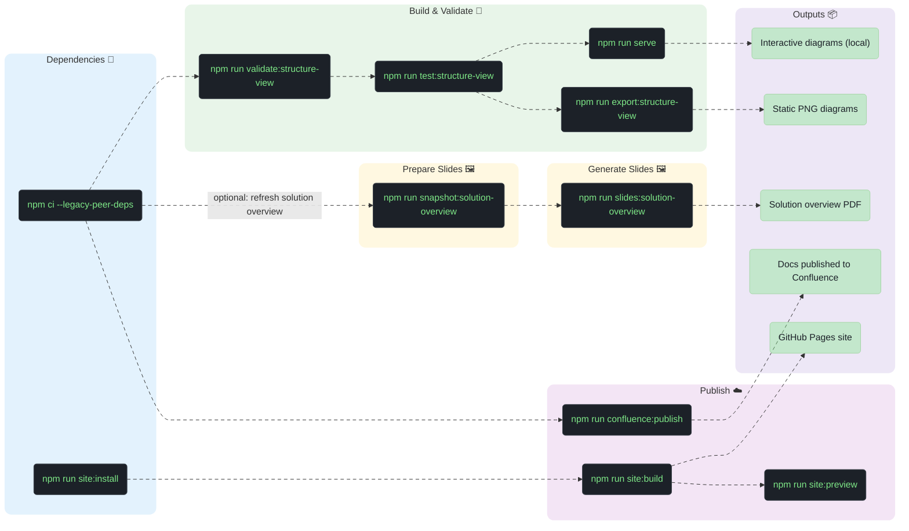

# Cattle Vaccination Documentation

This documentation set brings together architecture modelling and publishing workflows so the team can keep technical direction, delivery context and stakeholder outputs aligned. It follows a documentation as code approach so the model, views and supporting content are maintained together.

## Published Documentation

This repository publishes its contents to:

| Destination  | URL                        | Trigger                                                                                                   |
|--------------|----------------------------|-----------------------------------------------------------------------------------------------------------|
| GitHub Pages | https://defra.github.io/cattle-vaccination-documentation/ | Automatic on push to `main` via [`.github/workflows/ci.yaml`](.github/workflows/ci.yaml)                    |
| Confluence   | https://eaflood.atlassian.net/wiki/spaces/CVAC/pages/6287097924/Technology+View | Manual via `npm run confluence:publish` (see [Confluence Publishing Scope](#confluence-publishing-scope)) |

## Features

- Define and maintain an architecture model as code
- Generate interactive and static architecture views from that model
- Generate and maintain a **Solution Overview** from the modelled architecture and then:
  - package it as a PDF for stakeholder reviews, design sessions and so on
  - publish it to Confluence
- Publish other markdown from this repository to Confluence

## Tech Stack

- **[LikeC4](https://likec4.dev/)** - architecture-as-code modelling and interactive diagram visualisation
- **[Astro](https://astro.build/) + [Starlight](https://starlight.astro.build/)** - static site that publishes the same `technology/` markdown to GitHub Pages with interactive LikeC4 diagrams; see [`astro/README.md`](./astro/README.md)
- **[Marp CLI](https://github.com/marp-team/marp-cli)** - convert markdown slide decks (including the Solution Overview) into PDF outputs
- **[mark](https://github.com/kovetskiy/mark)** publish markdown content to Confluence
- **[Mermaid](https://mermaid.js.org/)** - diagram syntax used in markdown and pre-processed for slide generation
- **[Vitest](https://vitest.dev/)** - test automation for architecture model assertions
- **Node.js/npm** - script orchestration, local automation and dependency management

## Prerequisites

- Install **Node.js** (includes **npm**) and **Docker** using your preferred package manager
- For Confluence publishing, configure **`~/.config/mark.toml`** for [mark](https://github.com/kovetskiy/mark) authentication
  - Create a personal Atlassian API token first using the [Atlassian token guide](https://support.atlassian.com/atlassian-account/docs/manage-api-tokens-for-your-atlassian-account/); published updates are attributed to the token owner in Confluence
- Example for macOS with Homebrew and a full local setup

```sh
brew install node
brew install --cask docker
mkdir -p ~/.config
cat > ~/.config/mark.toml <<'EOF'
username = "foo@host.example"
password = "confluence-token-goes-here"
base-url = "https://eaflood.atlassian.net/wiki/"
EOF
npm ci --legacy-peer-deps
```

## Commands

| Script                                              | What it does                                                                                                                                                                                                                                                              |
|-----------------------------------------------------|---------------------------------------------------------------------------------------------------------------------------------------------------------------------------------------------------------------------------------------------------------------------------|
| `npm run serve`                                     | LikeC4 dev server with live preview (`npx likec4 serve`).                                                                                                                                                                                                                 |
| `npm run validate:structure-view`                   | Validate LikeC4 sources under `technology/current-state-views/structure-view`.                                                                                                                                                                                            |
| `npm run test:structure-view`                       | Run Vitest checks in [`test/structure-view.spec.ts`](test/structure-view.spec.ts) against the computed LikeC4 model.                                                                                                                                                      |
| `npm run export:structure-view`                     | Export diagrams as PNG from `technology/current-state-views/structure-view` into `technology/current-state-views/structure-view/images`.                                                                                                                                  |
| `npm run snapshot:solution-overview`                | Refresh `technology/quality-assurance-view/solution-overview` from `technology/current-state-views/structure-view` by replacing everything except `solution-overview.md` and `likec4.config.json`; excludes source `README.md` and `likec4.config.json`.                  |
| `npm run confluence:publish`                        | Publish markdown under **`technology/`** via [mark](https://github.com/kovetskiy/mark) in Docker; uses **`~/.config/mark.toml`** for authentication. `delivery-passport/` is excluded by default — see [Confluence Publishing scope](#confluence-publishing-scope).      |
| `npm run confluence:publish:with-delivery-passport` | Opt-in variant that also publishes **`delivery-passport/`**. Only use this when the matching Confluence pages are owned by this repository — see [Confluence Publishing scope](#confluence-publishing-scope).                                                             |
| `npm run slides:solution-overview`                  | Pre-process Mermaid in `technology/quality-assurance-view/solution-overview/solution-overview.md`, then Marp exports a **PDF** to `output/*-solution-overview.pdf`                                                                                                        |
| `npm run site:install`                              | One-time install of the Astro/Starlight site dependencies in `astro/`.                                                                                                                                                                                                    |
| `npm run site:dev`                                  | Start the Astro/Starlight dev server (auto-syncs `technology/` first); the same markdown that publishes to Confluence is served as a static site with interactive LikeC4 diagrams. See [`astro/README.md`](./astro/README.md).                                            |
| `npm run site:build`                                | Build the static site into `astro/dist/`. Deployed to GitHub Pages by `.github/workflows/ci.yaml` on push to `main`.                                                                                                                                             |
| `npm run site:preview`                              | Serve the built `astro/dist/` locally for inspection.                                                                                                                                                                                                                     |

## Confluence Publishing Scope

The `npm run confluence:publish` command publishes `technology/` only. The `delivery-passport/` tree is opt-in via `npm run confluence:publish:with-delivery-passport`. This default exists because some teams already maintain a hand-curated **Delivery Passport** page tree in Confluence (covering operational view, service context, etc.) outside of this repository. The `mark` tool updates any page whose title and parent path match a markdown file you publish, so a bulk publish from a fresh checkout could overwrite that hand-curated content. Excluding `delivery-passport/` by default makes the safe path the default. If Delivery Passport pages are also to be owned by this repository, the opt-in is available.

Notes:

- `mark` never deletes pages. Files removed from the repository (or roots excluded by this flag) simply stop being touched — existing Confluence pages remain as-is.
- Single-file publishes (`node scripts/publish-to-confluence.js path/to/file.md`) are unaffected by this scope filter and will publish any file inside the repository.

## Workflow

For the assurance solution overview, take a point-in-time snapshot from `structure-view` before generating slides or publishing.



## Example

Edit documentation and/or architecture (`.c4` files in `technology/current-state-views/structure-view/`) and then:
```shell
npm run validate:structure-view     # Validate LikeC4 syntax
npm run test:structure-view         # Run Vitest assertions on the architecture model
npm run serve                       # Interactive LikeC4 preview at localhost:5173
npm run export:structure-view       # Export architecture diagrams as PNG
npm run snapshot:solution-overview  # Occasional refresh of solution overview diagrams from structure view
npm run slides:solution-overview    # Generate PDF slide deck via Marp
npm run confluence:publish          # Publish docs to Confluence (requires Docker + ~/.config/mark.toml)
```

To set up and work with the GitHub Pages site locally:
```shell
npm run site:install    # One-time: install Astro/Starlight dependencies
npm run site:dev        # Local dev server for the GitHub Pages site
npm run site:build      # Build the site (also runs automatically in CI on push to main)
npm run site:preview    # Preview the built site before publishing
```

---
<sup>Generated from the [cookiecutter-docs-as-code](https://github.com/DEFRA/cookiecutter-docs-as-code) template.</sup>
