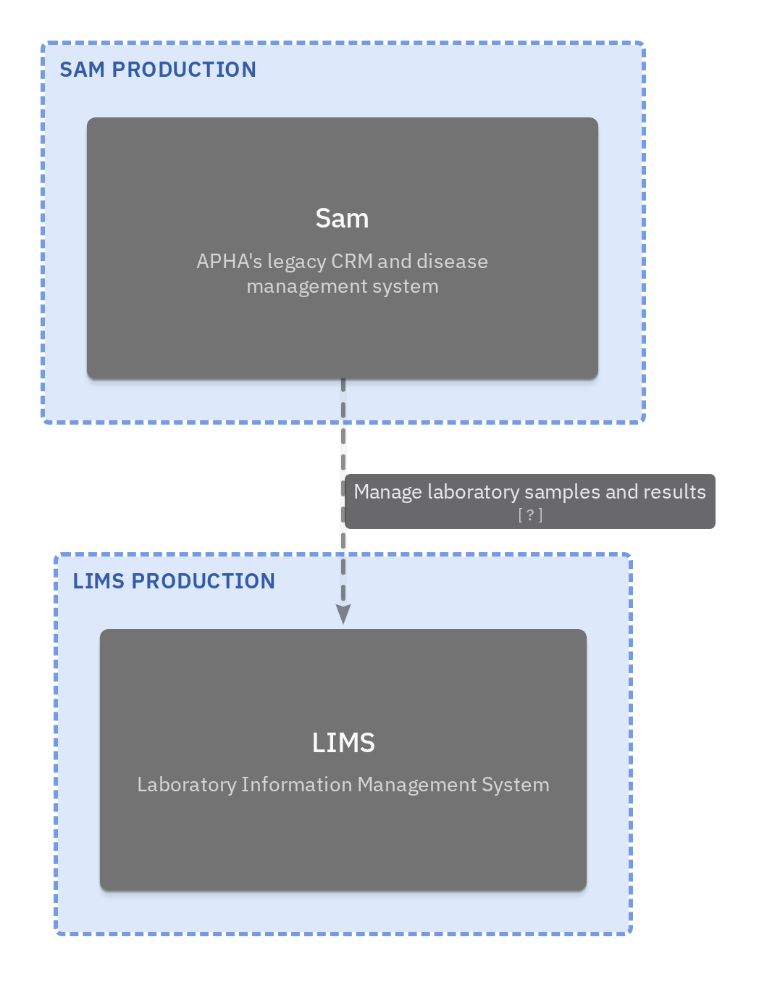
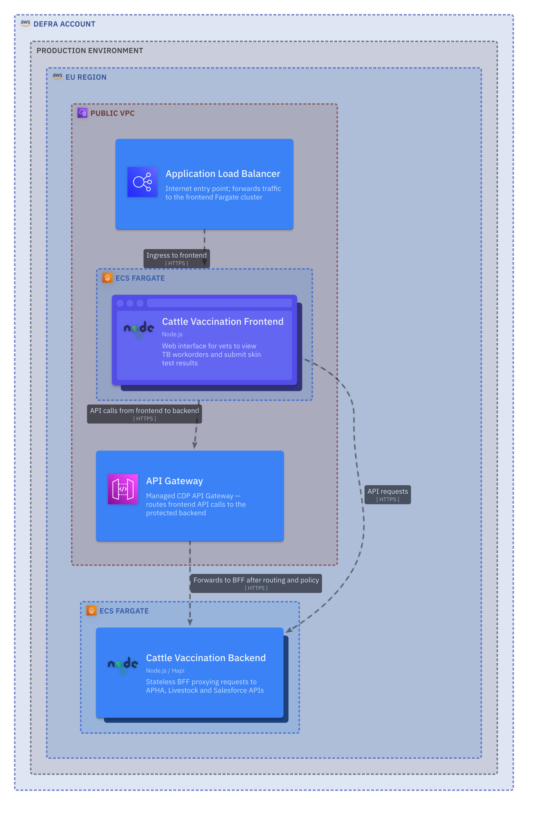

<!-- Space: CVAC -->
<!-- Parent: Delivery Passport -->
<!-- Parent: Technology View -->
<!-- Parent: Current State Views -->

# Software Deployment View

A _deployment view_ describes where the system runs and how runtime environments are arranged.
<!-- Include: ac:toc -->

## Domain Deployment

This deployment view shows the current runtime footprint of the cattle vaccination domain, including ingress, service hosting boundaries and data services in the platform environment.

## Bounded Context Deployments

### Cattle Vaccination Deployment

## Operational Readiness Minimum

Before production release, deployment readiness must include:

- [ ] service and dependency alerts configured with clear ownership
- [ ] deployment rollback procedure documented and rehearsed
- [ ] restore and reconciliation paths defined for data-impacting releases
- [ ] release communication and incident triage routes confirmed
