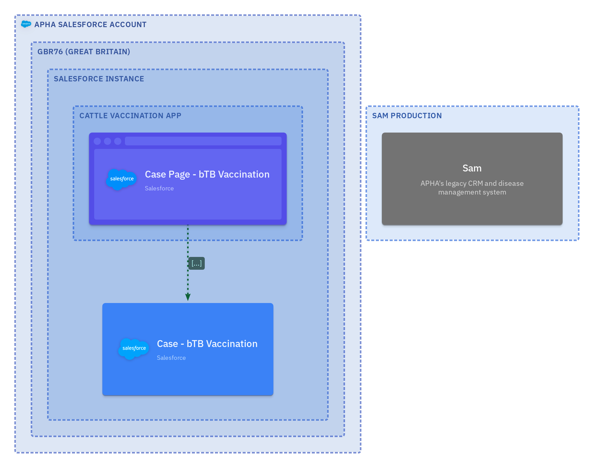
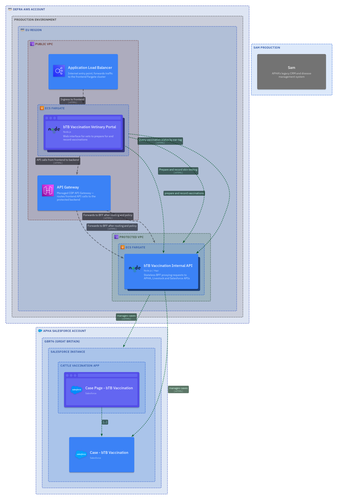
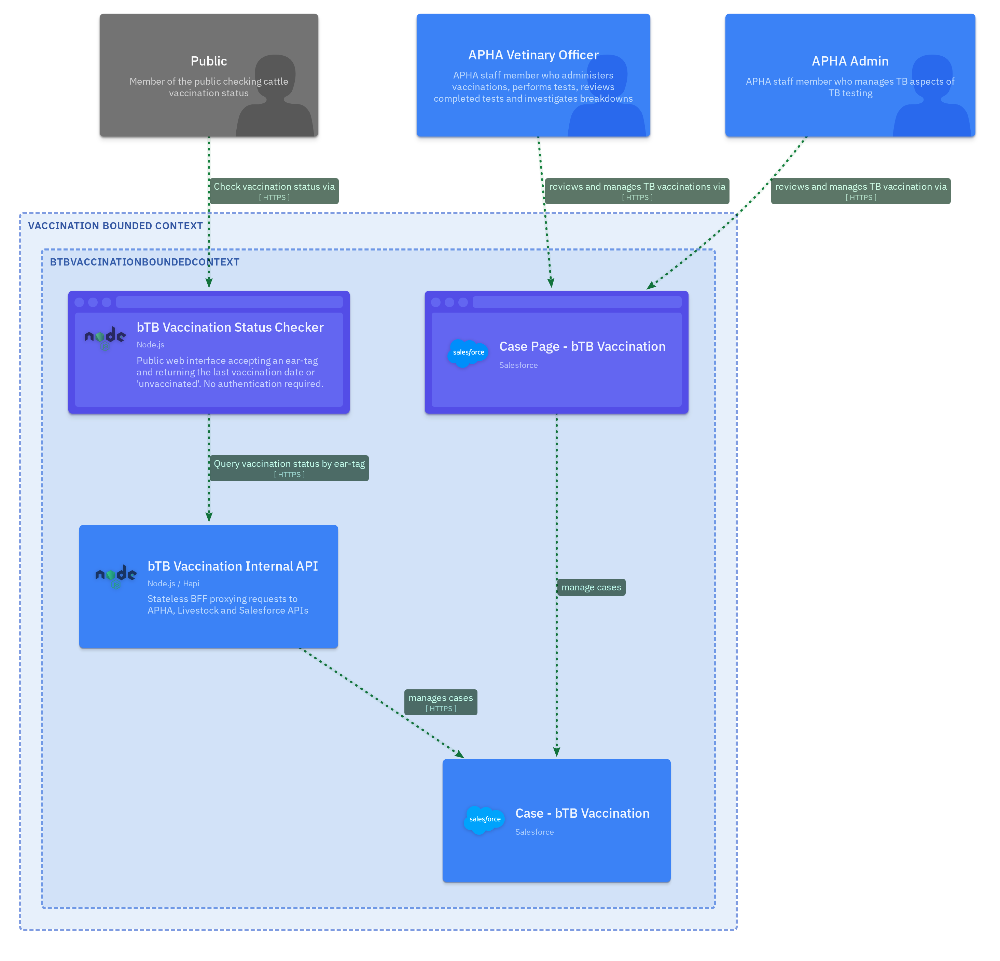
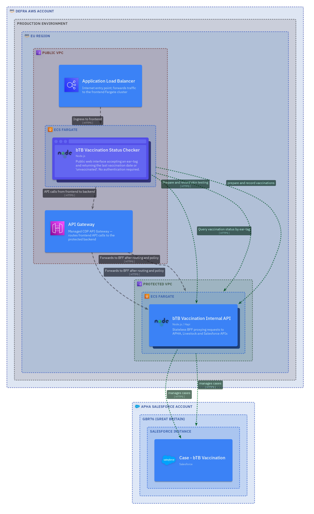
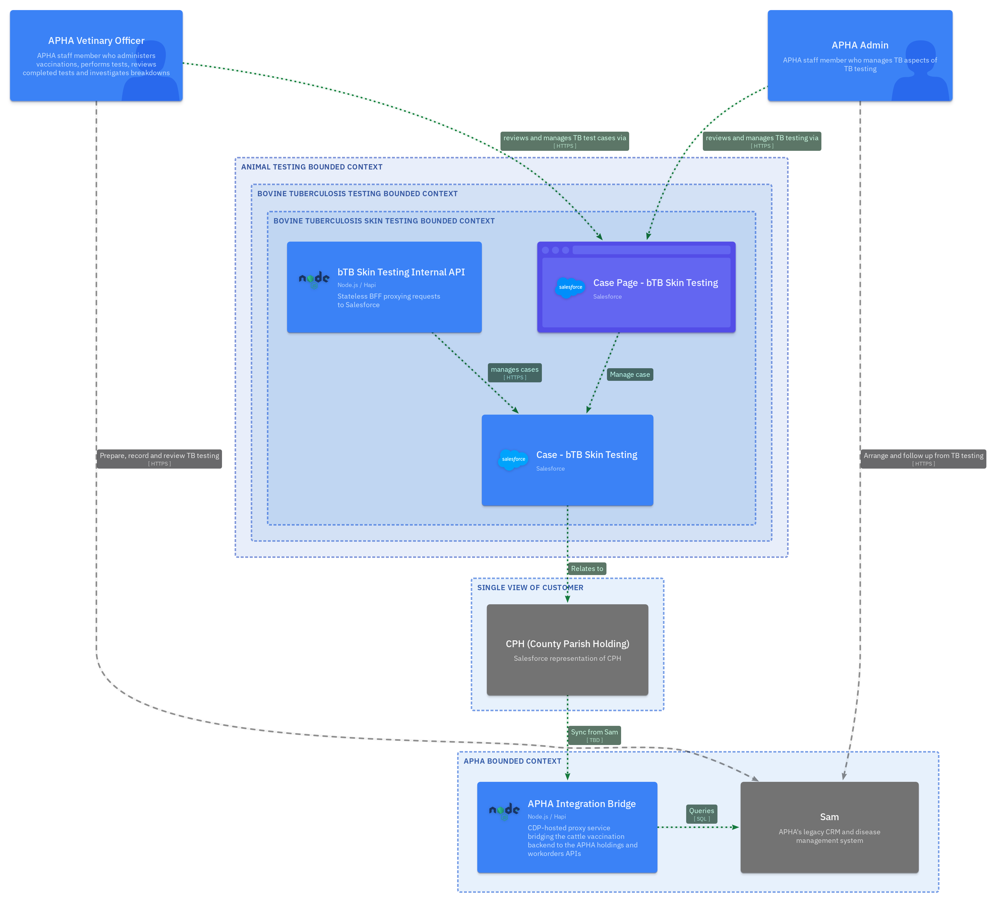
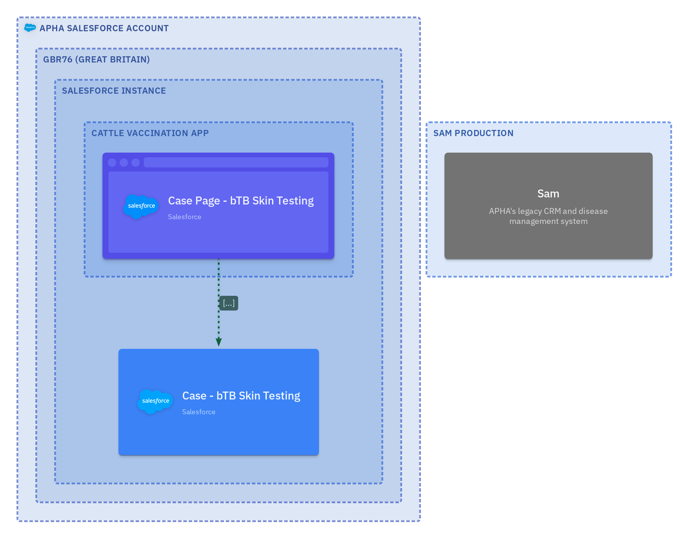
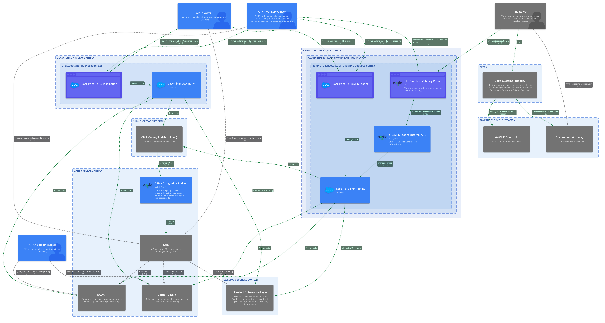
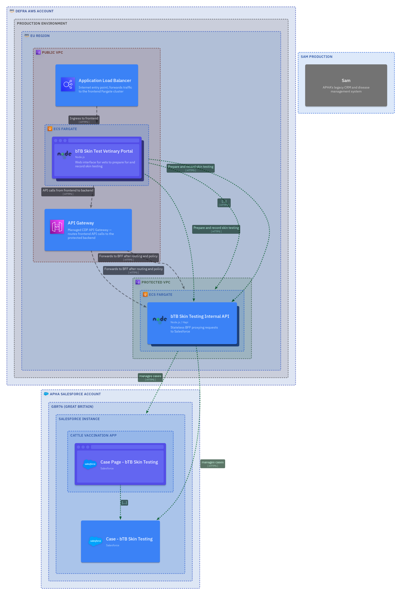
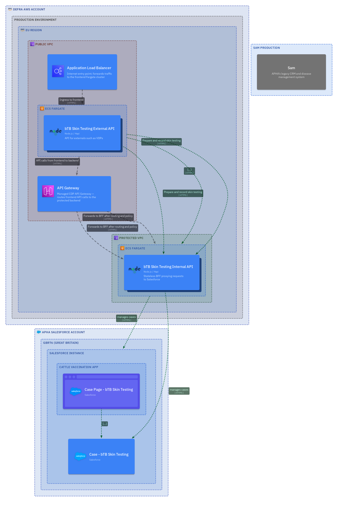

<!-- Space: CVAC -->
<!-- Parent: Delivery Passport -->
<!-- Parent: Technology View -->
<!-- Parent: Current State Views -->

# Software Evolution View

An _evolution view_ describes legacy, current and target architecture over time.
<!-- Include: ac:toc -->

## Legacy Architecture

_Evolution diagrams will be added here once legacy, current and target-state C4 views are defined in the structure-view model._

## Current Architecture

_See [Software Structure View](../structure-view/README.md) for the current container and context diagrams._

## Future Architecture

The future architecture evolves from the current Sam-centric state through six incremental delivery stages, progressively introducing vaccination recording, vet portals, public status checking, and TB skin testing capability. The complete future state is shown in the [Software Structure View](../structure-view/README.md).

### Stage 1 — Minimal Vaccination Recording

APHA Vets and Admins record TB vaccinations via internal Salesforce screens. The APHA Integration Bridge syncs CPH (County Parish Holding) data from Sam into the Single View of Customer. No external vet portal yet.

#### Deployment

---

### Stage 2 — Vaccination with Vet Portal

Adds a CDP-hosted frontend for private vets to prepare for and record TB vaccination site visits. Authentication via Defra Customer Identity (Government Gateway or GOV.UK One Login).

#### Deployment

---

### Stage 3 — Public Vaccination Status

Adds a public-facing status checker so that any member of the public can look up the most recent vaccination date for a tagged animal. No authentication required.

#### Deployment

---

### Stage 4 — Test Viewing

APHA staff can view TB skin test data in Salesforce via new internal case-management screens. The APHA Integration Bridge provides test records and workorder data from Sam.

#### Deployment

---

### Stage 5 — SICCT Testing (Vet Portal)

Adds a CDP-hosted testing portal so that private vets and APHA vets can submit SICCT skin test results online. Authentication via Defra Customer Identity.

#### Deployment

---

### Stage 6 — SICCT Testing (VDP API)

Adds a new External API so that Veterinary Delivery Partner systems (e.g. UK FarmCare TOM) can retrieve workorders and submit test results programmatically, complementing the vet portal from Stage 5.

#### Deployment

