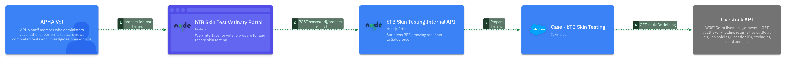
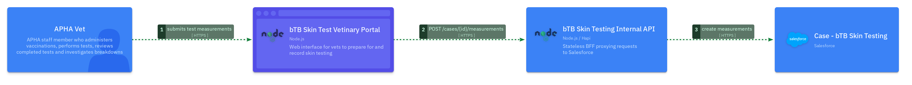
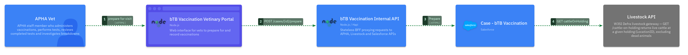
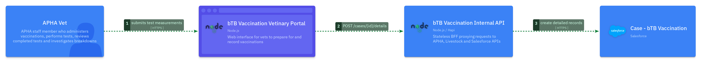

<!-- Space: CVAC -->
<!-- Parent: Cattle Vaccination Service -->
<!-- Parent: Technology -->
<!-- Parent: Current State Views -->

# Software Journey View

A _journey view_ describes key flows and scenarios across components.
<!-- Include: ac:toc -->

## Skin Testing

### Case Creation Journey

This journey shows the end-to-end flow for creating a new TB skin test case, initiation through the backend BFF to Salesforce.

### Test Visit Preparation Journey

This journey shows how a vet prepares for a farm visit for bTB skin testing.

### Test Result Submission Journey

This journey shows how a vet submits TB skin test measurements and results for a case, including the integration points used to store data in Salesforce.

## Vaccination

### Case Creation Journey

This journey shows the end-to-end flow for creating a new TB vaccination case, from initiation through the backend BFF to Salesforce.

### Test Visit Preparation Journey

This journey shows how a vet prepares for a farm visit for bTB skin testing.

### Test Result Submission Journey

This journey shows how a vet submits TB skin test measurements and results for a case, including the integration points used to store data in Salesforce.

