<!-- Space: CVAC -->
<!-- Parent: Cattle Vaccination Service -->
<!-- Parent: Technology -->
<!-- Parent: Current State Views -->

# Software Structure View

A _structure view_ describes the decomposition of the solution into containers and the boundaries between them.
<!-- Include: ac:toc -->

The Cattle Vaccination domain is composed of two delivery bounded contexts — **Vaccination** (bTB vaccinations) and **Animal Testing** (bTB skin testing) — alongside a **Veterinary Delivery Partners** context for third-party VDP integration, supported by three external integration boundaries: **APHA** (the Integration Bridge, AWS Cognito and the Sam legacy CRM), **Livestock** (cattle-on-holding data) and **SVOC** (Single View of Customer / CPH data). The diagrams below are organised bounded-context-first, following the [C4 model](https://c4model.com/): each context shown with its own context and container views, then zooming out to whole-domain views.

> **Note:** This view describes the proposed target architecture. All containers and relationships represent future state and are not yet in production.

## Bounded Contexts

### Vaccination

The Vaccination bounded context groups all animal vaccination delivery. It currently contains one inner context: **bTB Vaccination**.

#### Context

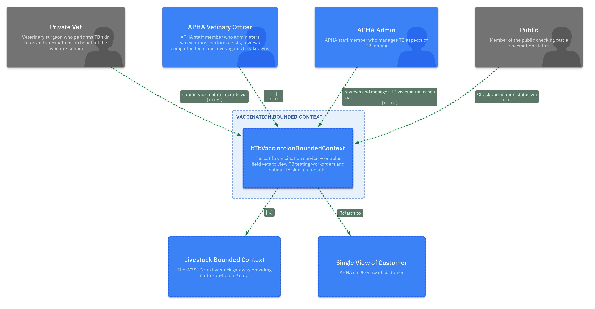

#### bTB Vaccination

The bTB Vaccination context delivers the cattle TB vaccination service. A web frontend lets field vets and APHA vets prepare for and record TB vaccination site visits. A stateless Node.js/Hapi BFF sits behind it, orchestrating calls to APHA (using Cognito for OAuth2 auth), Livestock and Salesforce.

##### Context

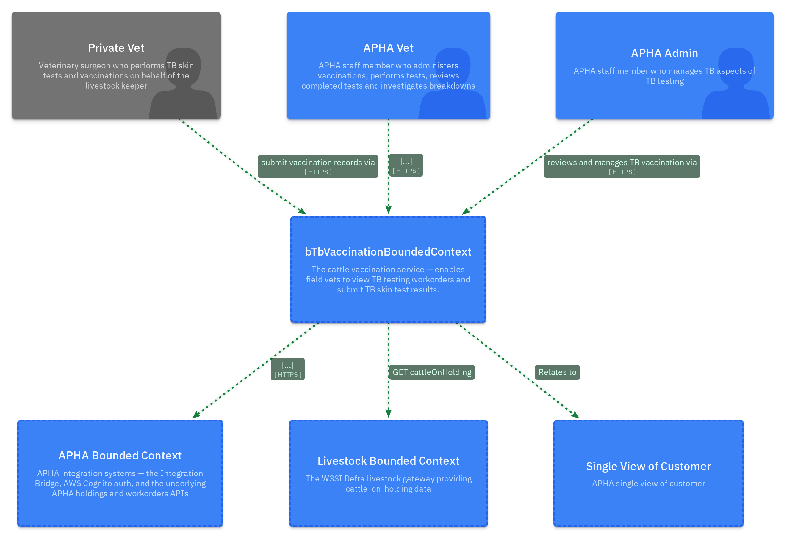

##### Container

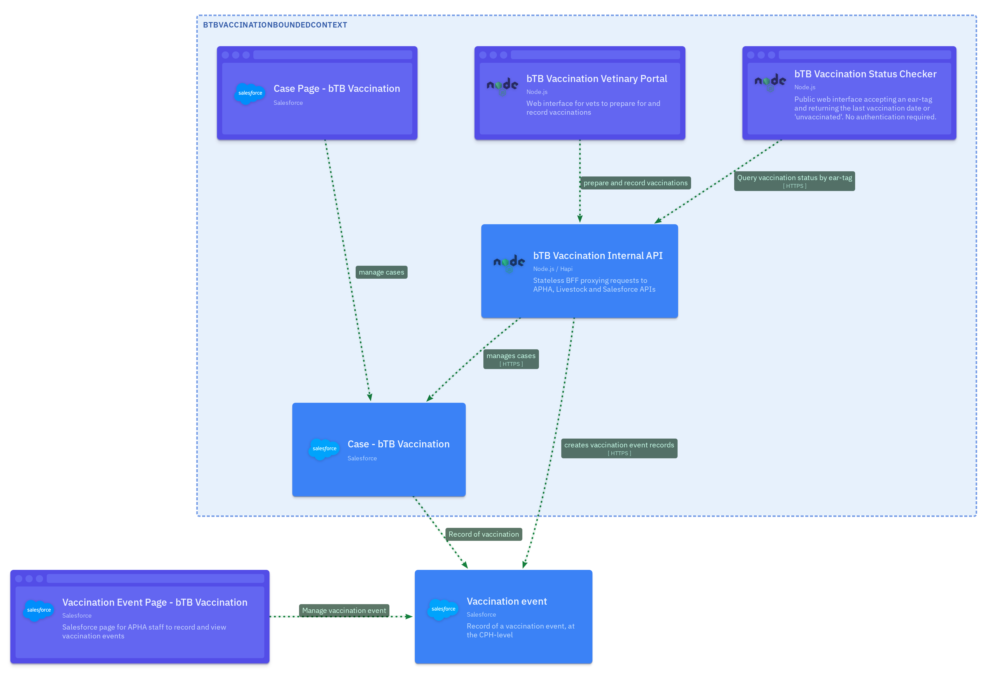

##### Backend Component

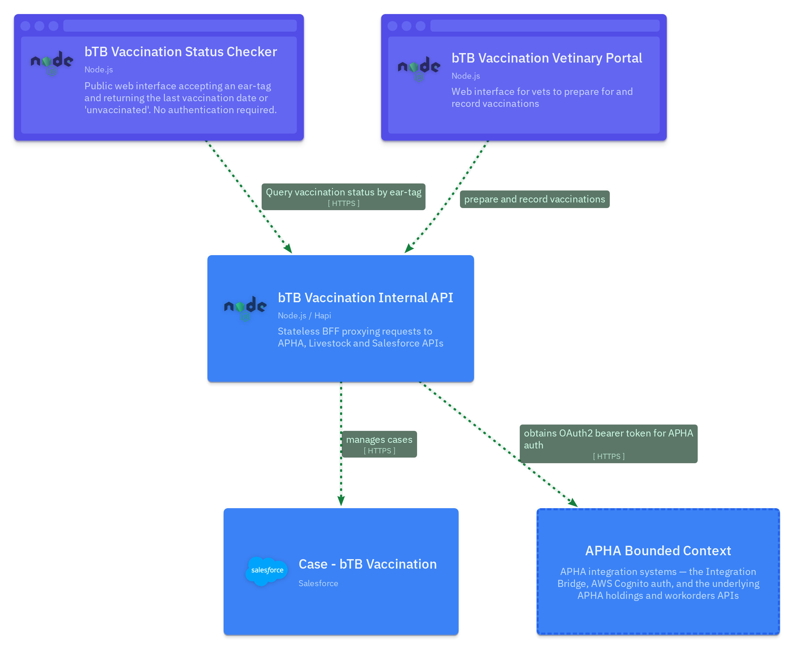

### Animal Testing

The Animal Testing bounded context groups all TB testing delivery. It contains **bTB Testing**, which in turn contains **bTB Skin Testing** — the context that delivers the active skin-test management service.

#### Context

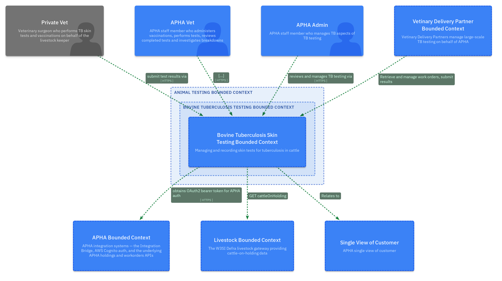

#### bTB Testing

##### Context

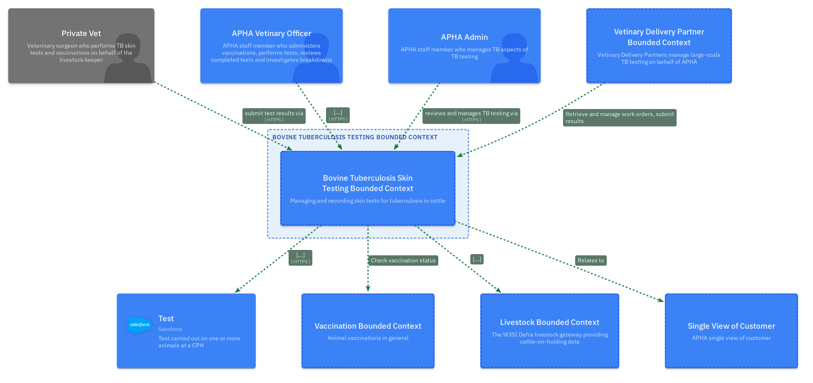

#### bTB Skin Testing

A web frontend lets field vets and APHA vets prepare for and record TB skin testing site visits. A stateless Node.js/Hapi BFF proxies calls to Salesforce. A separate External API allows VDP systems to retrieve workorders and submit test results.

##### Context

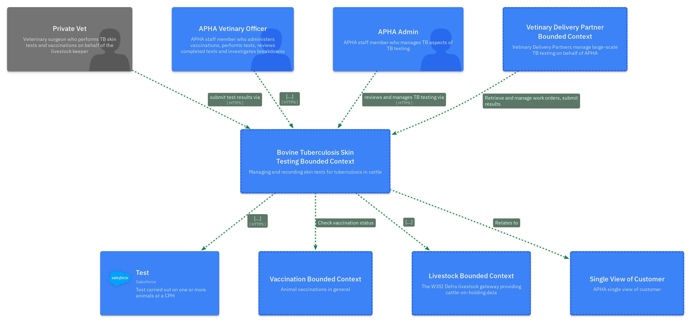

### Veterinary Delivery Partners

External systems (such as UK FarmCare TOM) used by Veterinary Delivery Partners — firms contracted by APHA to perform large-scale TB testing. These systems integrate with the bTB Skin Testing External API to retrieve workorders and submit results.

#### Context

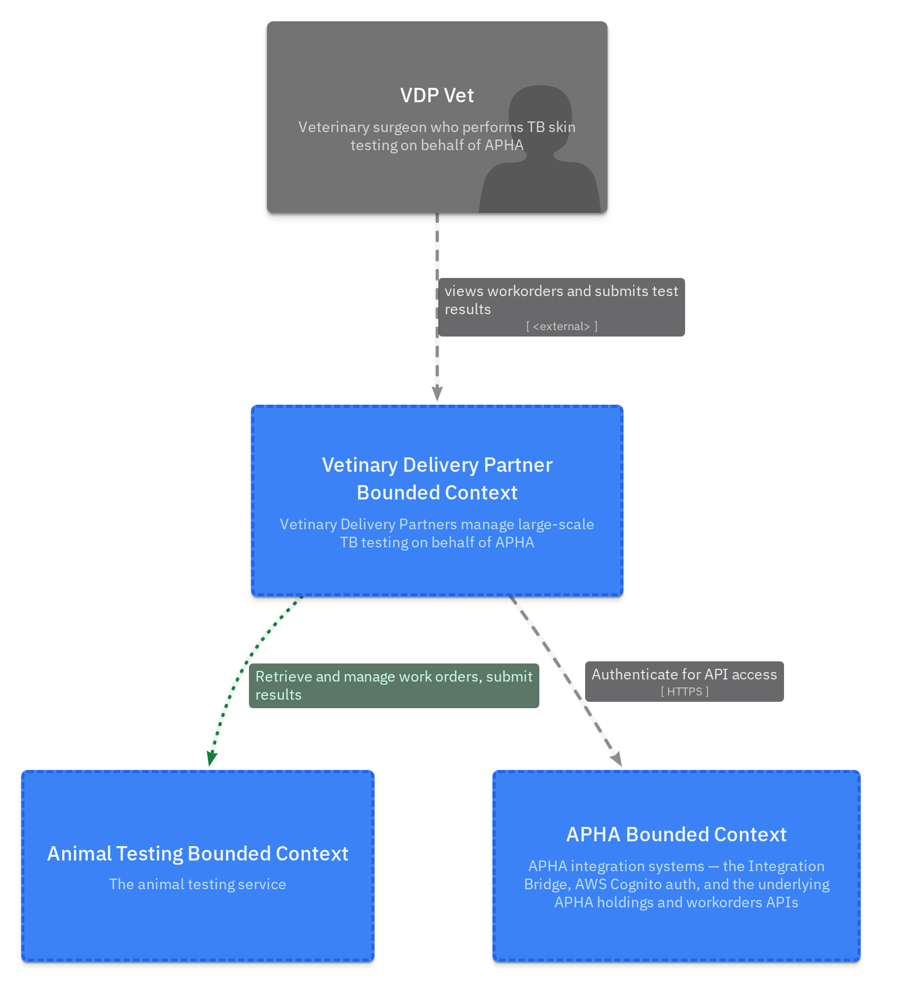

### Salesforce

Salesforce is the shared persistent storage layer for both delivery bounded contexts. The APHA Cattle Vaccination managed package hosts case objects and case management pages for both bTB Vaccination and bTB Skin Testing. APHA vets and admins manage cases directly via Salesforce pages; the delivery backend BFFs write case data via the Salesforce REST API.

### APHA

The APHA bounded context groups the **APHA Integration Bridge** (a CDP-hosted proxy service), the **AWS Cognito** instance used for OAuth2 authentication, and **Sam** — APHA's legacy CRM and disease management system. The Integration Bridge queries Sam directly and includes a Sync CPH mechanism that pushes CPH data into Salesforce.

#### Context

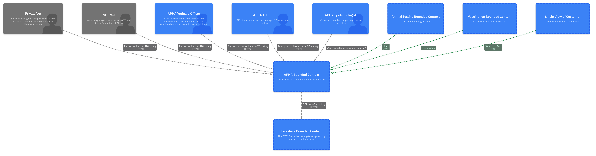

#### Container

### Livestock

The W3SI Defra livestock gateway, used to retrieve live cattle at a given holding. Returns cattle-on-holding data (excluding dead animals) by LocationID.

### Single View of Customer

The Single View of Customer bounded context provides CPH (County Parish Holding) data as a Salesforce representation. CPH records are synced from Sam by the APHA Integration Bridge.

#### Context

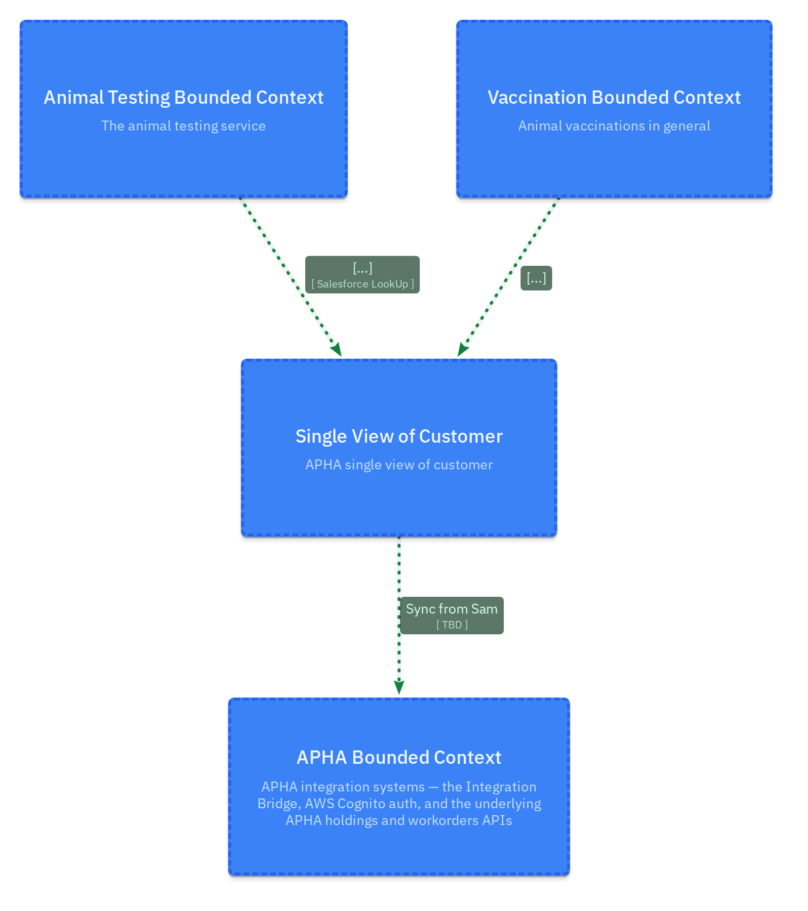

#### Container

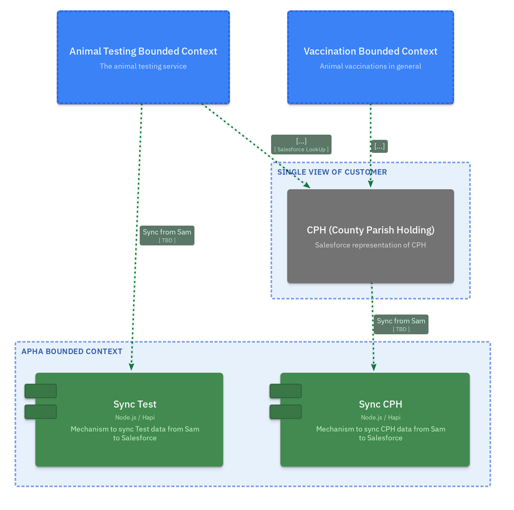

## Domain Context

Zooming out — all bounded contexts and actors in one picture.

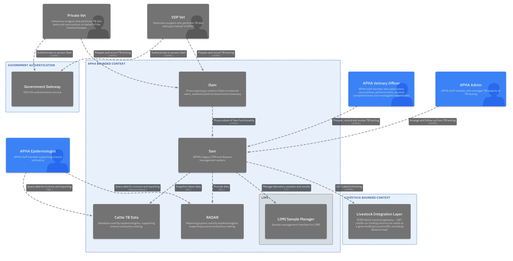

## Domain Containers

All containers across the domain in a single view.

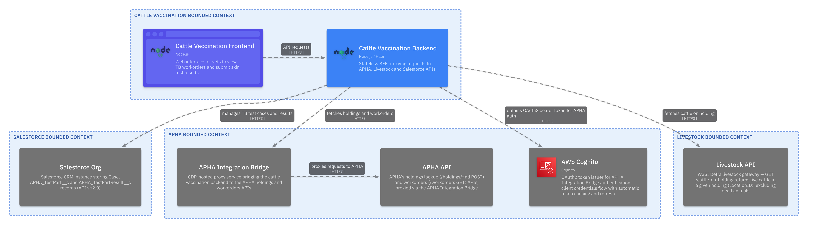
