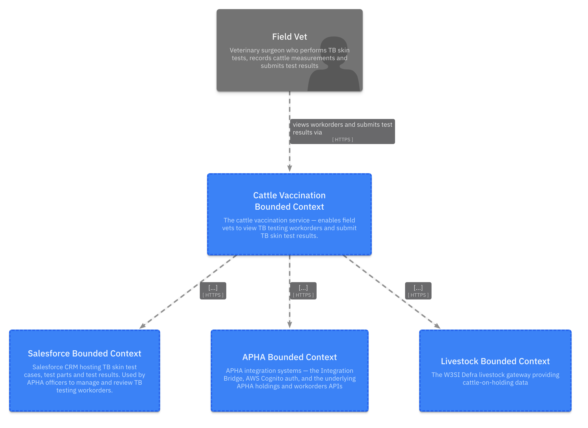
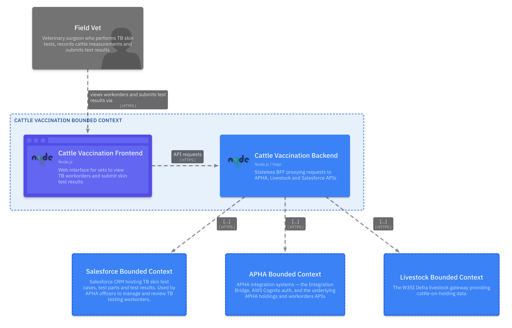
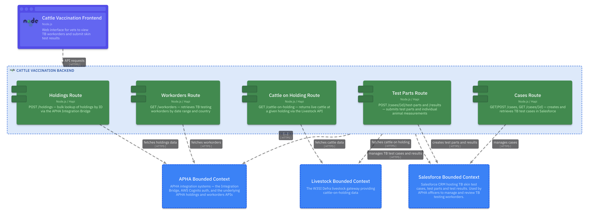
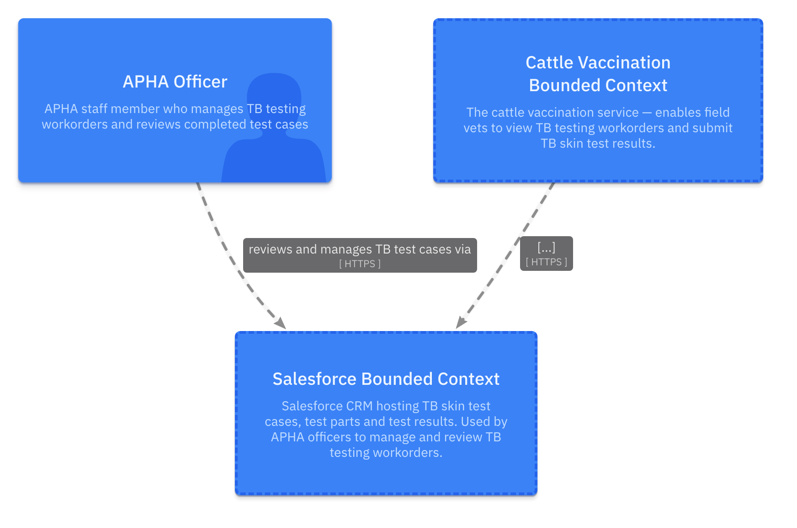
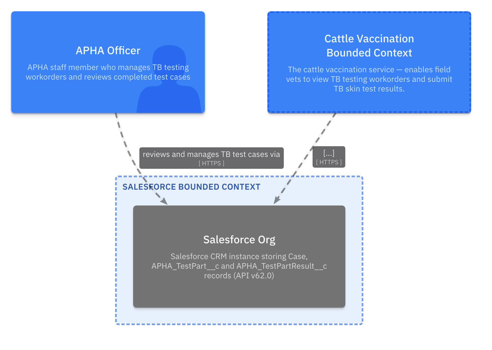

<!-- Space: CVAC -->
<!-- Parent: Cattle Vaccination Service -->
<!-- Parent: Technology -->
<!-- Parent: Current State Views -->

# Software Structure View

A _structure view_ describes the decomposition of the solution into containers and the boundaries between them.
<!-- Include: ac:toc -->

The Cattle Vaccination domain is composed of one delivery bounded context — **Cattle Vaccination** — supported by three external integration boundaries: **Salesforce** (case management), **APHA** (workorders and holdings) and **Livestock** (cattle data). The diagrams below are organised bounded-context-first, following the [C4 model](https://c4model.com/): each context shown with its own context and container views, then zooming out to whole-domain views.

## Bounded Contexts

### Cattle Vaccination

The core delivery bounded context. A web frontend lets field vets view TB workorders and submit skin test results. A stateless Node.js/Hapi BFF sits behind it, orchestrating calls to APHA, Livestock and Salesforce.

#### Context

#### Container

#### Backend Component

### Salesforce

The Salesforce CRM stores all TB test case data — cases, test parts and per-animal results. APHA officers manage cases here directly; the cattle vaccination backend writes to it via the Salesforce REST API.

#### Context

#### Container

### APHA

The APHA bounded context groups the APHA Integration Bridge (a CDP proxy service), the AWS Cognito instance used for authentication, and the underlying APHA holdings and workorders APIs.

#### Context

#### Container

### Livestock

The W3SI Defra livestock gateway, used to retrieve live cattle at a given holding.

## Domain Context

Zooming out — all bounded contexts and actors in one picture.

## Domain Containers

All containers across the domain in a single view.

