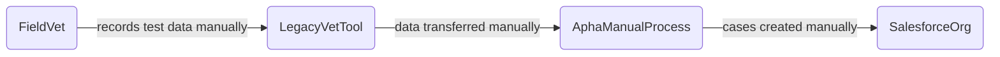
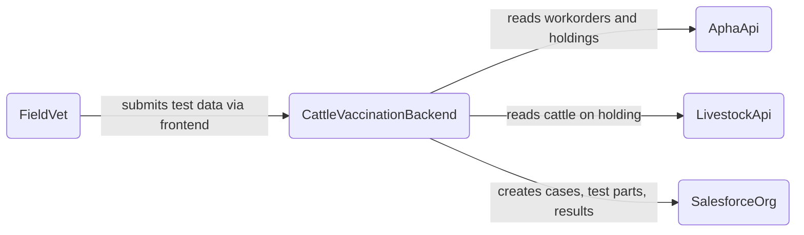
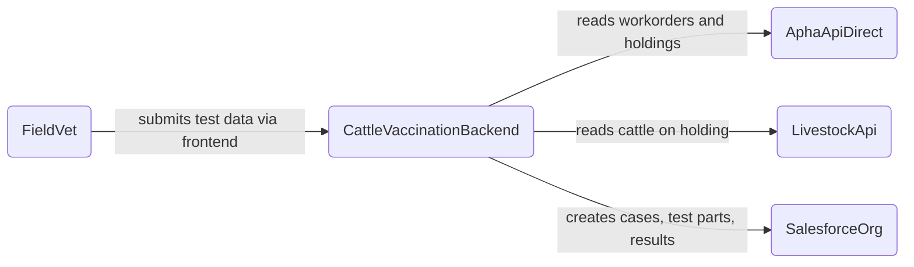
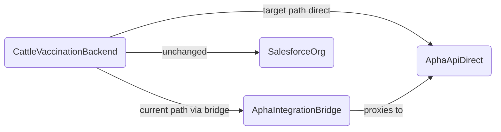

<!-- Space: CVAC -->
<!-- Parent: Delivery Passport -->
<!-- Parent: Technology View -->
<!-- Parent: Data Architecture -->

# Data Evolution View

An _evolution view_ describes the data landscape over time with legacy sources, current state and target models or platforms.
<!-- Include: ac:toc -->

## Legacy Data Landscape

Prior to the current service, TB skin test data was recorded outside Salesforce — workorder assignment and result submission were handled through separate, disconnected tools with no direct integration between the vet-facing workflow and APHA case management.

## Current Data Landscape

The current service connects field vets directly to Salesforce and APHA through a stateless BFF. Salesforce is the system of record; all TB test cases, test parts and results are written there in real time by the vet during the test visit.

## Target Data Landscape

The intended steady state retains Salesforce as the system of record but introduces cleaner ownership boundaries as the APHA API surface matures — reducing reliance on the Integration Bridge proxy as APHA exposes APIs directly consumable by the BFF.

## Transition

The transition period covers moving from the proxied APHA Integration Bridge to direct API consumption. During this phase both routes may be active and the BFF configuration determines which is used per endpoint.

## Future Architecture

The future data landscape evolves incrementally across six delivery stages. Each stage introduces new data flows without disrupting existing ones. The diagrams below show the data-relevant elements at each stage; the full software architecture for each stage is in the [Software Evolution View](../../current-state-views/evolution-view/README.md).

### Stage 1 — Minimal Vaccination Recording

Salesforce becomes the system of record for bTB vaccination data. The APHA Integration Bridge syncs CPH data from Sam into the Single View of Customer in Salesforce. Epidemiological data targets (cattleTbData, RADAR) continue to receive data from Sam via ETL; vaccination records in Salesforce are not yet replicated there.

### Stage 2 — Vaccination with Vet Portal

Private vets can write vaccination data to Salesforce directly via the BFF. The data model is unchanged; new data flows are the vaccination frontend writing via the BFF to the vaccination case objects in Salesforce.

### Stage 3 — Public Vaccination Status

Read-only public access to vaccination status is introduced. The bTB Vaccination Status Checker reads from Salesforce vaccination records via the BFF, exposing only the most recent vaccination date for a given ear-tag. No new data is written.

### Stage 4 — Test Viewing

Salesforce becomes the read surface for bTB test data that currently lives in Sam. The Integration Bridge provides test records and workorder data from Sam to the new internal Salesforce case pages. Data still originates in Sam; Salesforce provides a unified case management view.

### Stage 5 — SICCT Testing (Vet Portal)

Salesforce becomes the system of record for bTB skin test results. Private vets write SICCT skin test results to Salesforce directly via the testing BFF. Epidemiological ETL targets will need to pick up test data from Salesforce in the steady state.

### Stage 6 — SICCT Testing (VDP API)

VDP systems write test results via the External API, which in turn writes to the same Salesforce test case objects. The data model is the same as Stage 5; the new data flow is VDP system → External API → BFF → Salesforce.

