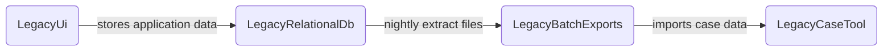
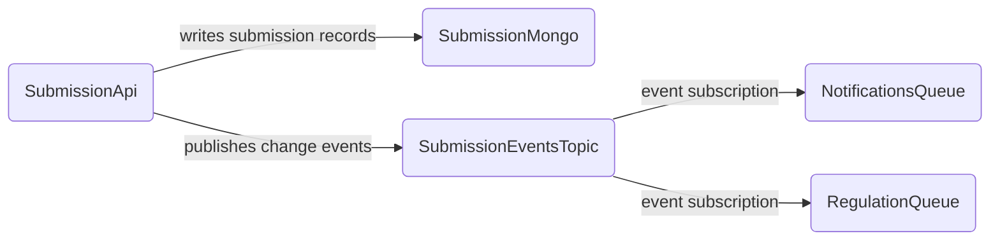
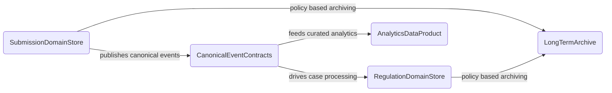
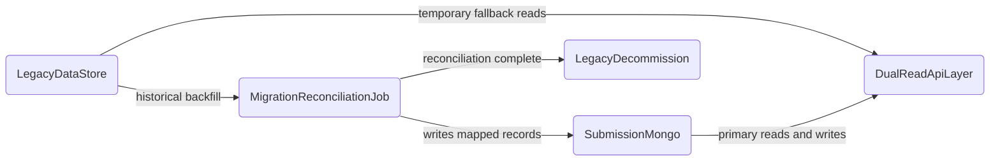

<!-- Space: CVAC -->
<!-- Parent: Cattle Vaccination Service -->
<!-- Parent: Technology -->
<!-- Parent: Data Architecture -->

# Data Evolution View

An _evolution view_ describes the data landscape over time with legacy sources, current state and target models or platforms.
<!-- Include: ac:toc -->

## Legacy Data Landscape

This legacy view represents older submission and case data pathways prior to domain separation and event-driven integration patterns.

## Current Data Landscape

This current-state view reflects the active licensing data topology with submission storage and asynchronous downstream sharing.

## Target Data Landscape

This target-state view shows the intended steady-state model with clearer ownership boundaries, canonical events, and governed archival paths.

## Transition and Dual-Run

This transition view shows coexistence and reconciliation while legacy pathways are progressively decommissioned.

