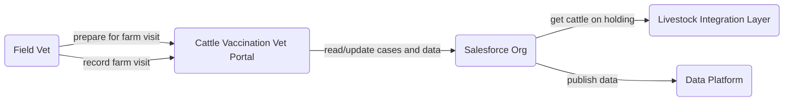
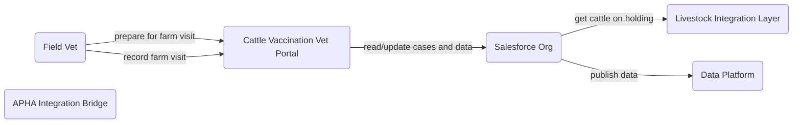
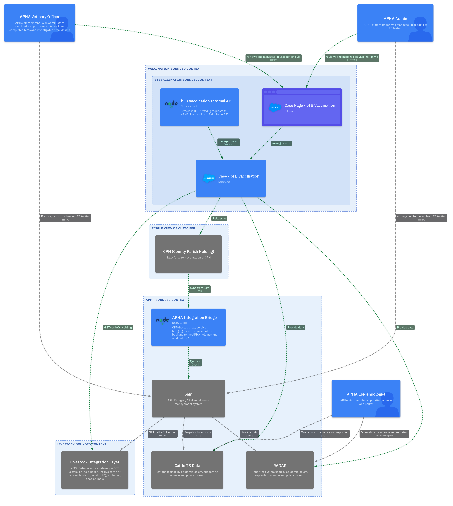
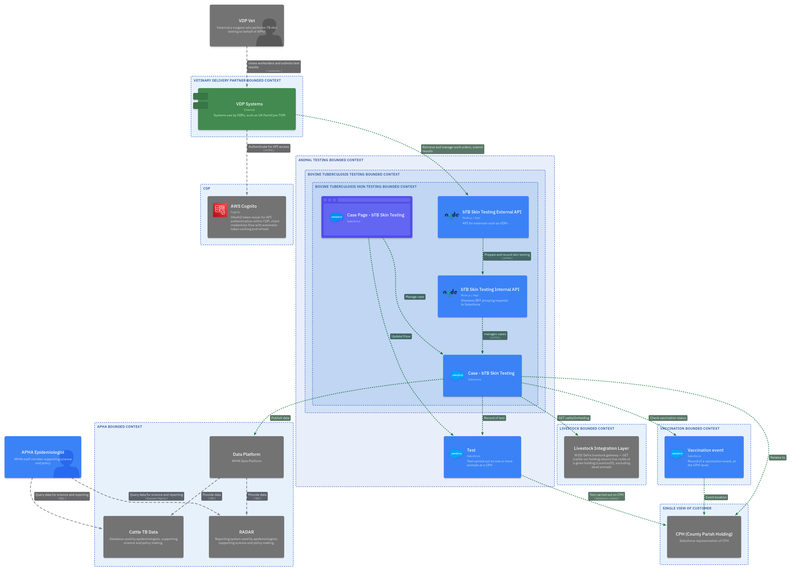
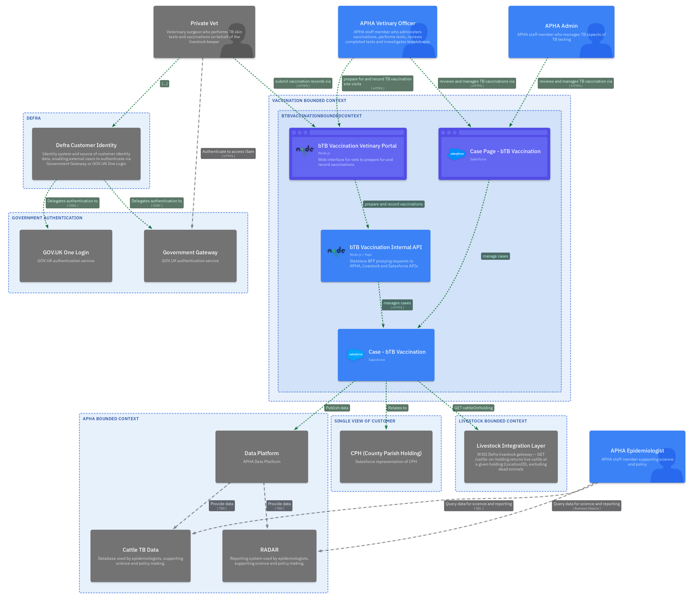

<!-- Space: CVAC -->
<!-- Parent: Delivery Passport -->
<!-- Parent: Technology View -->
<!-- Parent: Data Architecture -->

# Data Evolution View

An _evolution view_ describes the data landscape over time with legacy sources, current state and target models or platforms.
<!-- Include: ac:toc -->

## Legacy Data Landscape

Prior to the proposed service, TB skin test data was recorded in Sam. A representation of the schema can be found [here](../structure-view/sam/README.md).

Vaccination is new, therefore does not exist in the legacy model.

## Current Data Landscape

The Common Data Model is defined [here](https://eaflood.atlassian.net/wiki/spaces/SCVS/pages/5869699277/Data+Catalogue+for+Customer+and+Case+Data+Model). Particularlyh relevant are `CPH`, `Commodity` and `Commodity Animal`. Note that at the time of writing no CPH or commodity data is available in Salesforce although the schemas exist.

## Target Data Landscape

The proposed service extends the Common Data Model to record both testing results/history and vaccination events.

The far-future state makes Salesforce the system of record for vaccinations and testing, with data published to the data platform for consumption elsewhere.

## Transition

The transition period covers moving from the proxied APHA Integration Bridge to direct API consumption. During this phase both routes may be active and the BFF configuration determines which is used per endpoint.

## Future Architecture

The future data landscape evolves incrementally across six delivery stages. Each stage introduces new data flows without disrupting existing ones. The diagrams below show the data-relevant elements at each stage; the full software architecture for each stage is in the [Software Evolution View](../../current-state-views/evolution-view/README.md).

### Stage 1 — Minimal Vaccination Recording

Salesforce becomes the system of record for bTB vaccination data. The APHA Integration Bridge syncs CPH data from Sam into the Single View of Customer in Salesforce. Epidemiological data targets (cattleTbData, RADAR) continue to receive data from Sam via ETL; vaccination records in Salesforce are available to replicate via the Data Platform.

### Stage 2 — Test Viewing

Salesforce becomes the read surface for bTB test data that currently lives in Sam. The Integration Bridge provides test records and workorder data from Sam to the new internal Salesforce case pages. Data still originates in Sam; Salesforce provides a unified case management view.

### Stage 3 — SICCT Testing (Vet Portal)

Salesforce becomes the system of record for bTB skin test results. Private vets write SICCT skin test results to Salesforce directly via the testing BFF. Epidemiological data targets (cattleTbData, RADAR) obtain test data via the APHA Data Platform in the steady state.

### Stage 4 — SICCT Testing (VDP API)

VDP systems write test results via the External API, which in turn writes to the same Salesforce test case objects. The data model is the same as Stage 3; the new data flow is VDP system → External API → BFF → Salesforce.

### Stage 5 — Vaccination with Vet Portal

Private vets can write vaccination data to Salesforce directly via the BFF. The data model is unchanged; new data flows are the vaccination frontend writing via the BFF to the vaccination case objects in Salesforce.

### Stage 6 — Public Vaccination Status

Read-only public access to vaccination status is introduced. The bTB Vaccination Status Checker reads from Salesforce vaccination records via the BFF, exposing only the most recent vaccination date for a given ear-tag. No new data is written.

