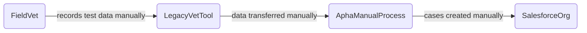
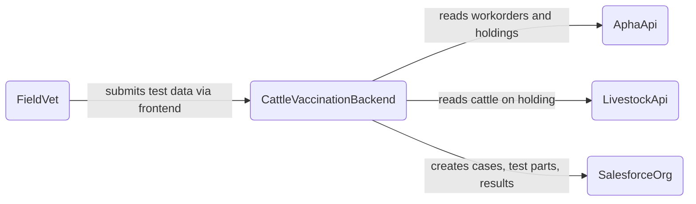
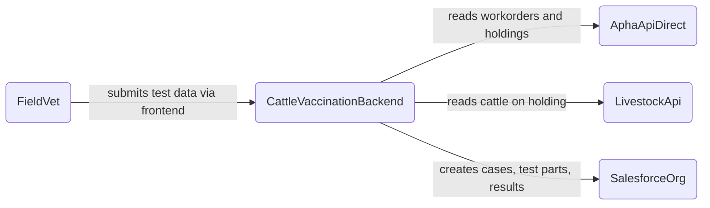
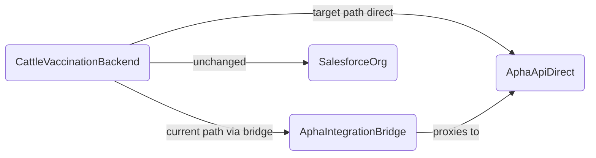

<!-- Space: CVAC -->
<!-- Parent: Cattle Vaccination Service -->
<!-- Parent: Technology -->
<!-- Parent: Data Architecture -->

# Data Evolution View

An _evolution view_ describes the data landscape over time with legacy sources, current state and target models or platforms.
<!-- Include: ac:toc -->

## Legacy Data Landscape

Prior to the current service, TB skin test data was recorded outside Salesforce — workorder assignment and result submission were handled through separate, disconnected tools with no direct integration between the vet-facing workflow and APHA case management.

## Current Data Landscape

The current service connects field vets directly to Salesforce and APHA through a stateless BFF. Salesforce is the system of record; all TB test cases, test parts and results are written there in real time by the vet during the test visit.

## Target Data Landscape

The intended steady state retains Salesforce as the system of record but introduces cleaner ownership boundaries as the APHA API surface matures — reducing reliance on the Integration Bridge proxy as APHA exposes APIs directly consumable by the BFF.

## Transition

The transition period covers moving from the proxied APHA Integration Bridge to direct API consumption. During this phase both routes may be active and the BFF configuration determines which is used per endpoint.

