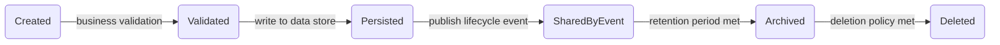
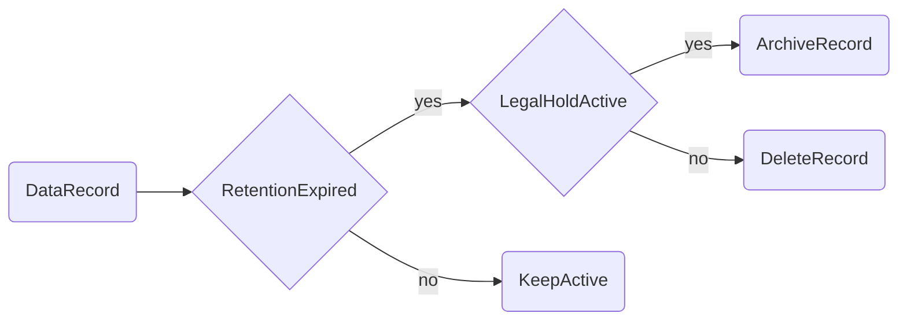

<!-- Space: CVAC -->
<!-- Parent: Cattle Vaccination Service -->
<!-- Parent: Technology -->
<!-- Parent: Data Architecture -->

# Data Lifecycle View

A _lifecycle view_ is the data counterpart of [Software Journey View](../../current-state-views/journey-view/README.md), showing how data is created, transformed, shared, archived and deleted.
<!-- Include: ac:toc -->

## Submission Data Lifecycle

This lifecycle shows the primary stages for submission data from initial capture to archive or removal.

## Case and Regulation Data Lifecycle

This lifecycle shows how submission data becomes regulatory case data and decision outcomes.

```mermaid
flowchart LR
  SubmissionEvent(SubmissionEvent)
  CaseOpened(CaseOpened)
  CaseReviewed(CaseReviewed)
  DecisionRecorded(DecisionRecorded)
  ApplicantNotified(ApplicantNotified)

  SubmissionEvent -->|"consumed by regulation process"| CaseOpened
  CaseOpened -->|"assessment updates"| CaseReviewed
  CaseReviewed -->|"finalise decision data"| DecisionRecorded
  DecisionRecorded -->|"emit decision notification"| ApplicantNotified
```

## Retention and Deletion Paths

This lifecycle decision flow shows how retention and GDPR-style deletion paths are applied.

