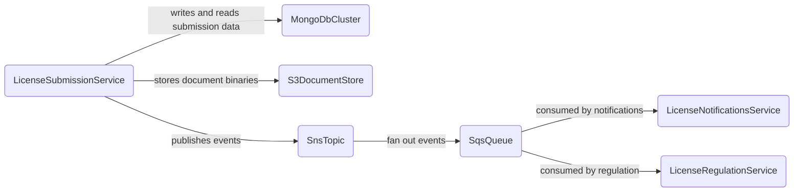
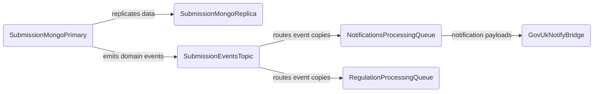
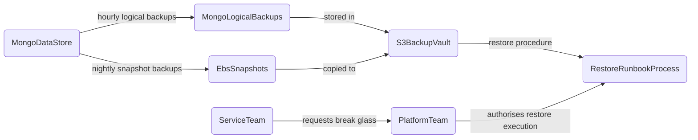

<!-- Space: CVAC -->
<!-- Parent: Cattle Vaccination Service -->
<!-- Parent: Technology -->
<!-- Parent: Data Architecture -->

# Data Physical View

A _physical view_ is the data counterpart of [Software Deployment View](../../current-state-views/deployment-view/README.md), showing which databases, lakes, buckets, topics and files hold data.
<!-- Include: ac:toc -->

## Current Data Stores

This physical view shows where operational licensing data is persisted and how storage responsibilities are split across bounded contexts.

## Data Movement and Replication

This movement view highlights how data flows between stores and integration channels, including internal replication and asynchronous handoff.

## Backup and Recovery Boundaries

This recovery view shows backup ownership and restore boundaries for critical data platforms.

