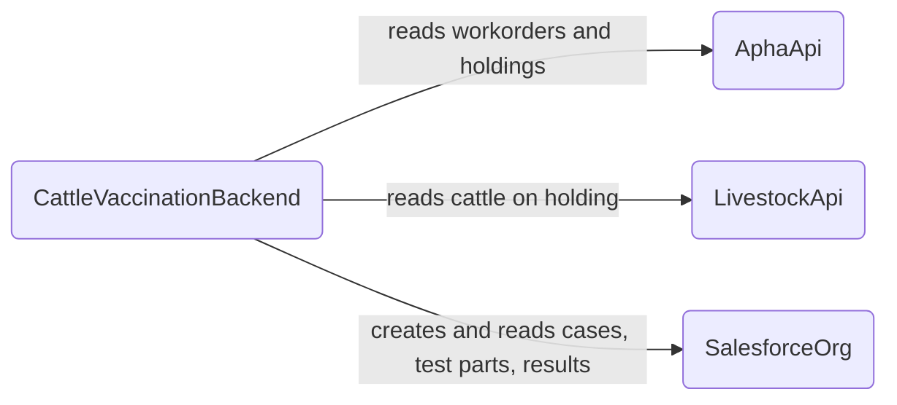
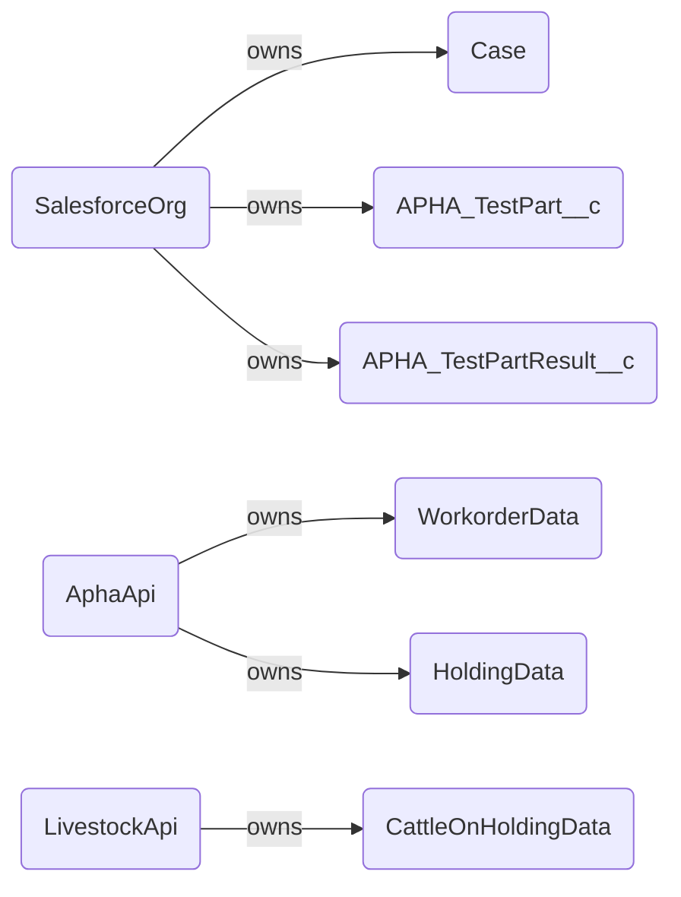
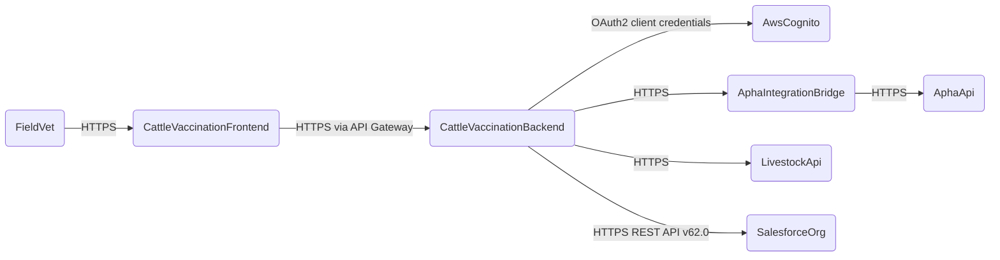

<!-- Space: CVAC -->
<!-- Parent: Cattle Vaccination Service -->
<!-- Parent: Technology -->
<!-- Parent: Data Architecture -->

# Data Physical View

A _physical view_ is the data counterpart of [Software Deployment View](../../current-state-views/deployment-view/README.md), showing which databases, lakes, buckets, topics and files hold data.
<!-- Include: ac:toc -->

**BOILERPLATE BELOW - NEEDS UPDATING**

## Current Data Stores

The cattle vaccination backend is stateless — it owns no database, queue or topic. All persistent state lives in Salesforce, which acts as the system of record for TB test cases, test parts and results. APHA and Livestock data is read-only at the point of request and is not cached or replicated.

## Data Ownership

This view shows which system owns each class of data and the direction of writes.

## Access and Boundaries

The BFF runs in a protected VPC and reaches all external data stores over HTTPS. There is no data replication, caching layer or message bus.

