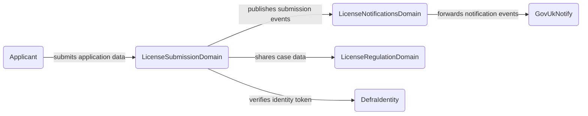
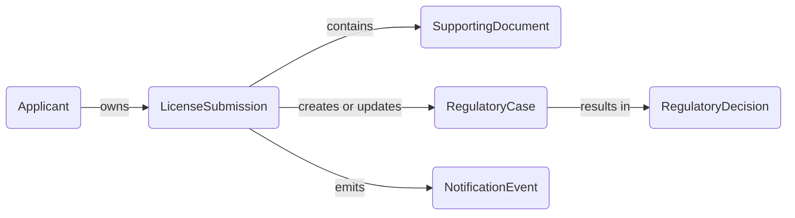
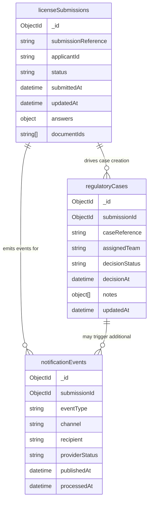
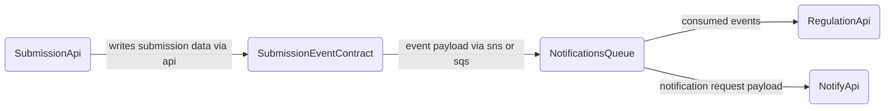

<!-- Space: CVAC -->
<!-- Parent: Cattle Vaccination Service -->
<!-- Parent: Technology -->
<!-- Parent: Data Architecture -->

# Data Structure View

A _structure view_ covers how information is organised: domains, conceptual and logical models, canonical definitions and how data is exchanged (events, APIs, files). It answers what the data is and how pieces relate, not yet where bytes live (see [Physical View](../physical-view/README.md)).
<!-- Include: ac:toc -->

## Conceptual Data Domains

This conceptual view shows the primary data domains and ownership boundaries across the licensing landscape.

## Logical Data Model

This logical view describes how core entities relate across the submission and regulation process.

## Collection and Attribute Model

This section defines the core Mongo collections, their key attributes and relationships in an ERD-style view.

## Data Exchange Boundaries

This exchange view maps the main data contracts and transfer mechanisms between bounded contexts.

