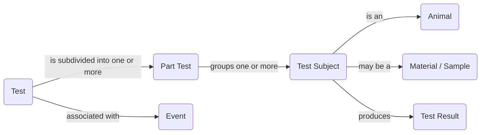
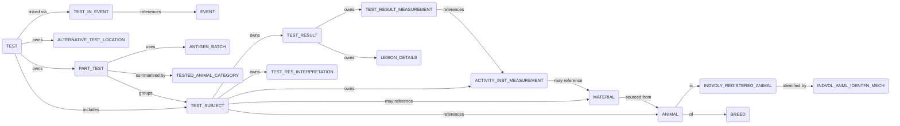
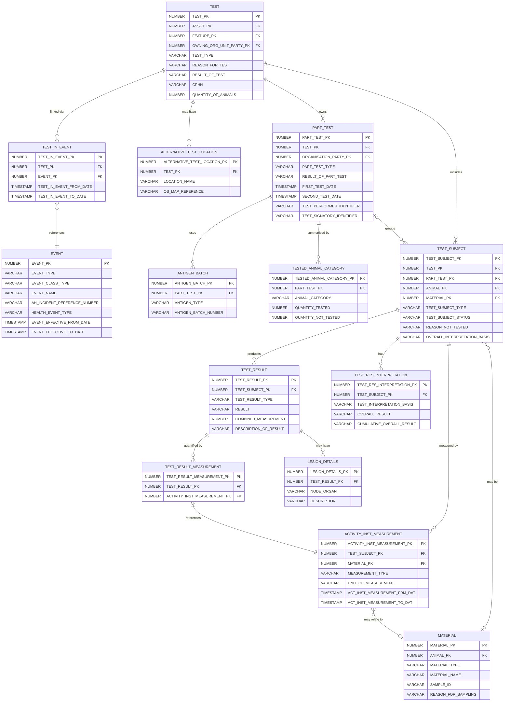
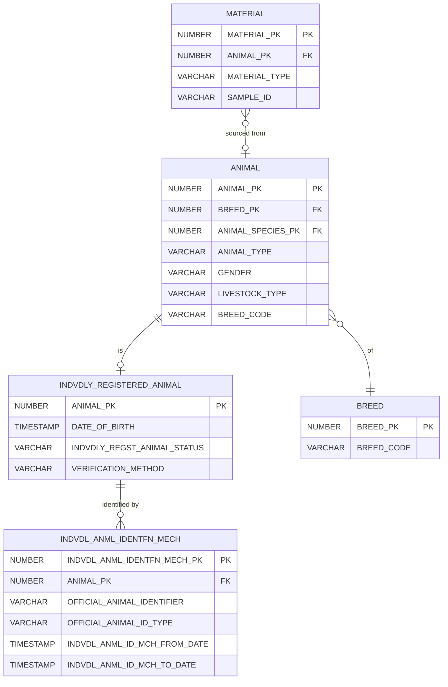

<!-- Space: CVAC -->
<!-- Parent: Delivery Passport -->
<!-- Parent: Technology View -->
<!-- Parent: Data Architecture -->
<!-- Parent: Data Structure View -->

# Data Structure View - Sam

This _structure view_ for Sam covers how information is organised: domains, conceptual and logical models, canonical definitions and how data is exchanged (events, APIs, files). It answers what the data is and how pieces relate, not where bytes live (see [Physical View](../../physical-view/README.md)).
<!-- Include: ac:toc -->

## Conceptual Data Domains

This conceptual view shows the primary data domains within the SAM database that relate to TB testing activities and results.

## Logical Data Model

This logical view shows how the core SAM entities relate across the TB skin test workflow, mapping entity ownership and the primary navigation paths through the model.

## SAM Physical Data Model

This section defines the core tables, their key fields and relationships in the SAM database (brp06 schema) for TB testing. The model is split into two focused diagrams: test execution and results, and animal identity.

### Test Execution and Results

### Animal Identity

`TEST_SUBJECT` links to `ANIMAL` via `ANIMAL_PK`, and `MATERIAL` records the animal from which a sample was taken.

> **Note:** `BREED` lives in the AHBRP schema rather than brp06. `ANIMAL` denormalises the breed code via `BREED_CODE` to avoid cross-schema lookups.

## Data Exchange Boundaries

TBD
