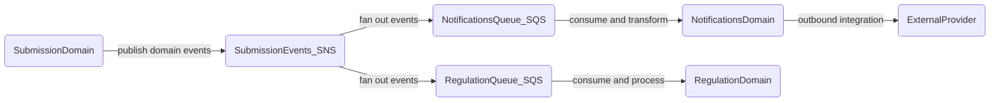

<!-- Space: CVAC -->
<!-- Parent: Cattle Vaccination Service -->
<!-- Parent: Technology -->
<!-- Parent: Integration Architecture -->

# Integration Patterns

This page records this team's integration patterns.

- Default direction: asynchronous event-driven communication
- Exception path: synchronous APIs only when immediate request/response is required
- Partner-specific contracts live in [Integration Interfaces](../interfaces/README.md)
- Runtime boundaries live in [Software Structure View](../../current-state-views/structure-view/README.md)

## Rule - Asynchronous Event-Driven Integration

Cross-context communication follows an asynchronous event-driven rule by default.

The default pattern for cross-context communication is **asynchronous event-driven integration using SNS/SQS**. This is the primary approach for submission, notifications and regulation handoffs because it supports decoupling, resilience and replay.

## Exception - Synchronous API Calls

Synchronous APIs are used as an explicit exception to the default async pattern.

Use synchronous API calls when an immediate request/response is required (for example validation, lookup or user-facing confirmation) and where coupling and latency trade-offs are acceptable.

## Platform Reference

For platform-level options and implementation detail, refer to:

- [CDP Reference Architecture](https://portal.cdp-int.defra.cloud/documentation/architecture/reference-architecture.md)
