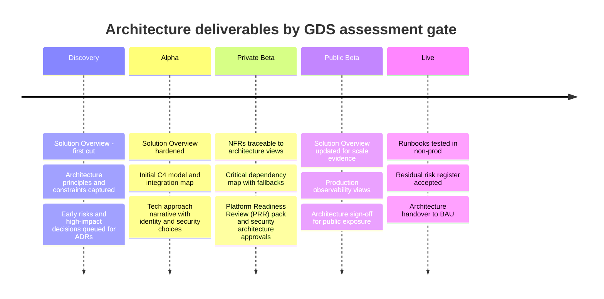

<!-- Space: CVAC -->
<!-- Parent: Cattle Vaccination Service -->
<!-- Parent: Technology -->

<!-- Macro: :box:([^:]+):([^:]*):(.+):
     Template: ac:box
     Icon: true
     Name: ${1}
     Title: ${2}
     Body: ${3} -->

# Quality Assurance

**Quality Assurance** holds material for steering, design authority and stakeholder assurance. Projects move through the GDS Service Standard phases — **discovery**, **alpha**, **private beta**, **public beta** and **live** — with a service assessment at each gate from Alpha onwards. Gate-specific deliverables sit in those stages; some artefacts (notably **Solution Overview**) are **living documents** that start early and stay current through every gate until the service is live.

The timeline below is an **architecture** view, showing the architecture deliverables typically tracked at each gate — not the full programme or product roadmap.

## Discovery Governance Checklist

- [x] Problem statement, scope and success outcomes agreed
- [ ] Initial architecture principles, constraints and assumptions captured
- [ ] Early architecture risks and dependencies identified
- [ ] High-impact decisions queued for ADRs
- [ ] Governance and delivery owners confirmed

## Alpha Readiness Checklist

- [ ] Solution Overview hardened through Alpha learnings
- [ ] Initial C4 container and component model published
- [ ] Integration map drafted with external systems, owners and status
- [ ] Technology approach narrative agreed and anchored to CDP

## Private/Public Beta Readiness Checklist

- [x] Service-level NFRs agreed and traceable to architecture views
- [ ] Dashboards and alerts reviewed with clear incident response ownership
- [ ] Runbooks available for operational support and common failure modes
- [ ] Critical dependencies mapped with fallback and escalation approach
- [ ] Security and architecture approvals planned with [Platform Readiness Review (PRR)](https://portal.cdp-int.defra.cloud/documentation/onboarding/onboarding-process.md#platform-readiness-review) date and owner confirmed

## Production Readiness Checklist

- [ ] Operational runbooks tested in non-production
- [ ] Alerting, and if applicable, on-call ownership and escalation paths confirmed
- [ ] Backup, restore and retention policies verified
- [ ] Security approvals and residual risk acceptance recorded
- [ ] Service support model confirmed for BAU
