<!-- Space: CVAC -->
<!-- Parent: Delivery Passport -->
<!-- Parent: Technology View -->
<!-- Parent: Quality Assurance -->

<!-- Macro: :box:([^:]+):([^:]*):(.+):
     Template: ac:box
     Icon: true
     Name: ${1}
     Title: ${2}
     Body: ${3} -->

# Solution Overview

<!--
marp: true
theme: defra
_class: lead
paginate: true
backgroundColor: #fff
-->

        
  
Solution Overview

  
APHA

  
Cattle Vaccination

  

  
Version 0.2

  
Chris Barrett

  
10/06/2026

---

<!--
footer: 'OfficialCattle Vaccination Solution Overview v0.1'
-->

<!-- Macro: \!\[.*\]\((.+)\)\<\!\-\- width=(.*) \-\-\>
     Template: ac:image
     Attachment: ${1}
     Width: ${2} -->

# Contents

1. About This Document

2. Version Control

3. Solution Description

3.1 Summary and Scope

3.2 Goals, Principles, Objectives, Constraints

3.3 Requirements Summary

3.4 Security Summary

3.5 Current Solution

4. Solution Architecture

4.1 Context Model

4.2 Business Architecture

4.3 Data Architecture

4.4 Application Architecture

4.5 Technology Architecture

4.6 Integration Architecture

4.7 Security Architecture

4.8 Deployment Architecture

4.9 User Roles

4.10 Support

4.11 Architecture Evolution

5. Patterns

5.1 Patterns Consumed

5.2 Patterns Exported

6. Cut-over, Conversion and Fall-back

7. Architectural Dependencies

8. Glossary

---

# 1. About This Document

- The Solution Overview (SO) consolidates key architectural artefacts created during initial stages of the delivery process. The Solution Overview will provide sufficient architecture to represent the high-level architectural design necessary to support the Business requirements as detailed within the Solution Overview (SO), whilst also capturing any key dependencies and/or any patterns consumed.

- The Solution Overview (SO) should be aligned to the endorsed Delivery Group (Solution) Roadmap(s), [here](https://defra.sharepoint.com/teams/Team3221/Soln%20and%20App%20Architecture/Published?csf=1&web=1&e=wfMsrs&CID=adc61151-1cba-4b70-b0a0-06e0463a4000).

- The point above implies that the Solution Overview (SO) should also align to the approved Enterprise Architecture Principles, [here](https://defra.sharepoint.com/teams/Team3221/SitePages/Strategic-Architecture-Principles.aspx).

- The Solution Overview (SO), spans all architecture domains (Business, Data, Application, Integration and Technology) primarily focusing on the Initial Operating Capability (IOC) but in some cases may include information relating to the proposed Future Operating Capability (FOC) to be used as context only.

- The Solution Overview (SO) will be reviewed by key stakeholders within the Delivery Group and approved by the Principal Architect within the Solution Design Authority (SDA) or designated deputies, if appropriate.

- Additional artefacts may be incorporated into this Solution Overview (SO) where they provide additional context and/or clarification. Further detail can be found within the Digital Delivery Architecture Functions, architectural repository or associated architectural deliverables, artifacts and/or building blocks.

- The architecture models within the Solution Overview (SO) will be supplemented and complemented with an appropriate level of narrative.

---

# 2. Version Control

| Version | Date       | Description                                  | Owner         | Reviewer(s) |
|---------|------------|----------------------------------------------|---------------|-------------|
| 0.1     | 09/06/2026 | Initial draft to go with alpha document pack​ | Chris Barrett | TBD         |
| 0.2     | In-progress | Post-alpha                                   | Chris Barrett | TBD         |

📌 <strong>Action:</strong> Assign reviewer(s).

---

# 3. Solution Description

## 3.1 Summary and Scope

### Summary

APHA cannot control bovine tuberculosis without a way to​:
- assign & track which cattle have been vaccinated​
- assign DIVA testing to vaccinates​
- assign SICCT testing to non-vaccinates​
- record and review vaccinations and test results. 

This prevents vaccine administration, DIVA testing and assurance activities.​

### Challenge

TB skin test data is currently managed through an end-of-life system (Sam) which can not be updated to support or be aware of vaccination. 

📌 <strong>Action:</strong> Align with the endorsed Delivery Group Roadmap and confirm scope boundaries with the programme.

---

## 3.2 Goals, Principles, Objectives, Constraints

Outcomes, enterprise design principles, measurable objectives and constraints for this programme.

### 3.2.1 Business​ Goals

1. Assign & track which cattle have been vaccinated against bTB​
    1. Vets must be able to record which cattle have been vaccinated, along with the relevant details such as dates and batch numbers​
    1. APHA must be able to use bTB vaccination data when investigating breakdowns​
    1. APHA must be able to use bTB vaccination data in epidemiological and other scientific studies​
    1. Potential buyers and other interested parties must be able to determine if, and how recently, an animal has been vaccinated​
1. Assign DIVA testing to vaccinates​
    1. A new type of skin test (DIVA) for bTB will be needed, and must be applied to vaccinated cattle​
    1. APHA must be able to use DIVA skin test data when investigating breakdowns​
    1. APHA must be able to use DIVA skin test data in epidemiological and other scientific studies​
1. Assign SICCT testing to non-vaccinates​
    1. The existing SICCT skin test for bTB will remain in use for unvaccinated herds​
    1. The existing SICCT skin test should not be applied to vaccinated cattle since it will result in false positives​
1. Record and review vaccinations and test results​

---

### 3.2.2 Principles

This design aligns with the Strategic Architecture Principles as follows:

- **Delivery-Focused Architecture** - Architecture is a service to delivery teams. Architecture principles will support seamless delivery pipelines, enabling rapid, low-risk releases.
- **Design for Users** - Create intuitive, accessible, user-friendly and consistent solutions that simplify access and improve user experience.
- **Maximise Value, Minimise Waste** - Focus on delivering greater value to customers and citizens through reuse of common capabilities and effective technology management.
- **Clean Data, Clear Decisions** - Ensure data is clean, accurate, consistent, timely and accessible.
- **Connect and Collaborate** - Create a flexible, connected and interoperable ecosystem through integration, automation to ensure streamlined user journeys and seamless data flows.
- **Secure Today, Safe Tomorrow** - Implement robust security measures to protect data and systems to maintain a secure environment.
- **Empower to Innovate** - Provide the business with the knowledge and tools to enable them to use their creativity to deliver innovative change.
- **Right Tools, Right Place** - Equip staff with the necessary tools and devices to ensure effective communication and operations in all conditions.

These are taken from the [Strategic Architecture Principles](https://defra.sharepoint.com/teams/Team3221/SitePages/Strategic-Architecture-Principles.aspx) document.

📌 <strong>Action:</strong> Confirm each principle applies as written, or record deliberate alternatives with rationale.

---

### 3.2.3 Objectives

Objectives for the initial phase of private beta

1. **Cattle vaccination status**
    1. Establish vaccination status registration & checker
1. **bTB skin testing infrastucture outside of Sam**
    1. Establish bTB test viewing function for admins (Salesforce)​
    1. Establish vet testing service; SICCT only​
    1. Establish vet testing service (API interface); SICCT only​
    1. Establish bTB test scheduling function for admins; SICCT only​

📌 <strong>Action:</strong> Add three measurable objectives that trace to the goals above.

### 3.2.4 Constraints

1. It is not considered feasible to make changes to the existing system Sam which is currently used to manage and review bTB testing as well as for wider surveillance and post-breakdown case-working activities​
1. The strategic case-working system chosen by APHA is Salesforce
1. Policy is unlikely to be aligned across the devolved nations - see table below for probable scenarios

| Nation | Policy |
|--------|--------|
| England | Initial APHA-led and -funded rollout to specific herds (keepers can opt out) in parallel with and moving to a keeper-led and -funded model. |
| Wales | No government funding; keepers must arrange and pay for their own vaccinations and vet |
| Scotland | Officially TB-free; individual farmers may still vaccinate at their own cost |

The obligation to record vaccinations is expected to exist in all nations.

---

## 3.3 Requirements Summary

Detailed requirements will be developed during the initial phases of beta based on the goals and
objectives listed previously along with the prototypes that have been tested during alpha.​

| ID | Description                                                                                                                              |
|----|------------------------------------------------------------------------------------------------------------------------------------------|
| 1  | Enable field vets to view their assigned TB testing workorders, fetched from APHA via the Integration Bridge                            |
| 2  | Enable vets to look up live cattle at a given holding via the W3SI Livestock API                                                         |
| 3  | Enable vets to create a TB test case in Salesforce and submit day-1 and day-2 skin measurements for each animal tested                   |

📌 <strong>Action:</strong> Replace or extend with the full requirements catalogue or backlog items that drive this architecture.

---

## 3.4 Security Summary

📌 <strong>Action:</strong> Document security from a business perspective; align with assurance and data classification policy.

### 3.4.1 Data Classification, Handling Instructions, Sensitive Data

📌 <strong>Action:</strong> List data classes, handling rules and sensitive data types for this service. TB test data includes animal identifiers (ear tags) and farm location data (CPH numbers).

### 3.4.2 Business Processes (Security)

📌 <strong>Action:</strong> Outline security-relevant business processes (for example access, breach, subject access).

### 3.4.3 Accreditation and Assurance

The following assurance deliverables will be created for the solution:

- TBC, but might include some or all of:
  - NCSC principles
  - OWASP ASVS
  - ITHC
  - Accreditation Packs – initial and pre-go-live
  - Protective Monitoring
  - GDPR & Data Privacy

---

## 3.5 Current Solution
<!-- _class: split split-25-75 -->

- Current TB processes are centered around Sam, a PEGA-based system which has reached a point where it is not economical to make further changes.
- Non-APHA users access a subset of the Sam screens via a Government Gateway login, this is known as iSam​
- Up-to-date holdings data is requested when needed from CTS and ScotEID via the Livestock Integration Layer​
- TB data is extracted via ETL to the cattleTbData database and to the RADAR reporting system​

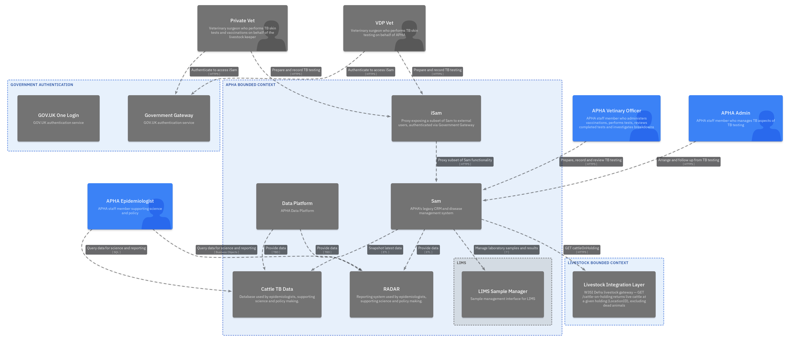

---

# 4. Solution Architecture
<!-- _class: split split-25-75 -->

## 4.1 Context Model

The diagram shows the current architecture for the cattle vaccination domain. The cattle vaccination bounded context sits at the centre, with three external integration boundaries: APHA (workorders and holdings), Livestock (cattle data) and Salesforce (case management and results).

---

## 4.2 Business Architecture

This diagram presents a _capability realisation view_, illustrating how key business capabilities are supported and delivered across the solution.

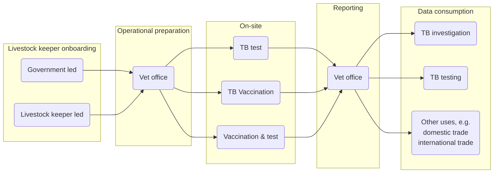

---

## 4.3 Data Architecture
<!-- _class: split split-25-75 -->

### 4.3.1 Data Design

The logical data model for the cattle vaccination **alpha prototype**.

A **Case** represents a TB test event for a holding. It is linked to a CPH number (`APHA_CPH__c`) and records the reason for test and test window dates.

An **APHA_TestPart__c** represents a testing visit within a case — recording day-1 inoculation and day-2 reading dates, and the identity of the certifying vet and tester.

An **APHA_TestPartResult__c** represents a single animal's result within a test part — recording the ear tag, test type (SICCT, DIVA or Not Tested), and the skin measurement readings.

All data is stored in Salesforce via the Salesforce REST API (v62.0).

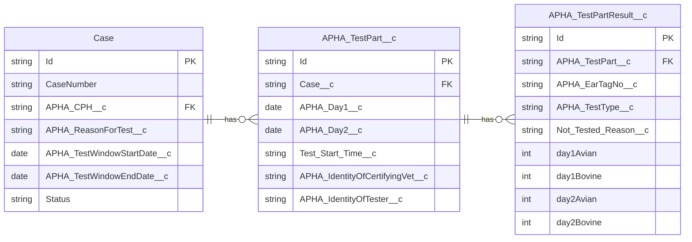

---

### 4.3.2 Data Flow — Case Creation

The diagram shows how data flows when a vet creates a new TB skin test case.

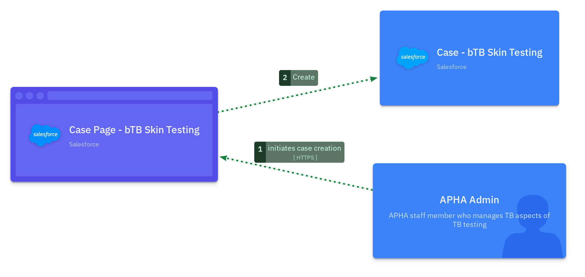

---

### 4.3.3 Data Flow — Test Result Submission (APHA)

The diagram shows how data flows when an APHA vet submits TB skin test measurements.

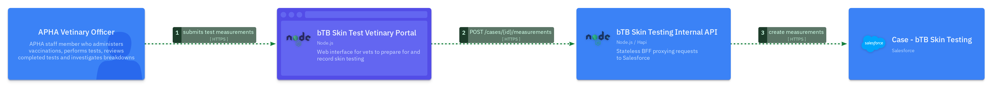

### 4.3.3 Data Flow — Test Result Submission (private)

The diagram shows how data flows when a private vet submits TB skin test measurements.

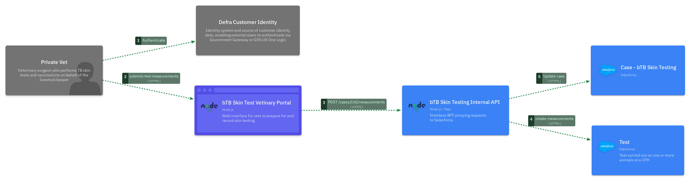

---

### 4.3.4 Data Retention

📌 <strong>Action:</strong> Align this section with your DPIA / records schedule.

---

## 4.4 Application Architecture

| Component                       | Purpose / Description                                                                                                 |
|---------------------------------|-----------------------------------------------------------------------------------------------------------------------|
| Cattle Vaccination Frontend     | Web interface for field vets; drives the workorder view, cattle lookup and test result submission journey             |
| Cattle Vaccination Backend      | Stateless BFF; proxies and orchestrates calls to APHA Integration Bridge, Livestock API and Salesforce               |
| bTB Vaccination Status Checker  | _(Future)_ Public-facing web interface; accepts an ear-tag and returns the last vaccination date or 'unvaccinated'. No authentication required. Deployed on CDP; calls the Cattle Vaccination Backend. |
| APHA Integration Bridge         | CDP-hosted proxy to APHA APIs; provides holdings lookup and workorders retrieval                                       |
| AWS Cognito                     | OAuth2 token issuer for APHA Integration Bridge authentication; client credentials flow                               |
| Livestock API                   | W3SI Defra livestock gateway; returns live cattle at a given CPH holding                                              |
| Salesforce Org                  | CRM storing TB test cases (`Case`), test visits (`APHA_TestPart__c`) and per-animal results (`APHA_TestPartResult__c`) |

📌 <strong>Action:</strong> When the solution changes, update these rows so the Application Architecture stays aligned.

---

## 4.5 Technology Architecture
<!-- _class: split split-30-70 -->

Core Delivery Platform (CDP) is the strategic platform for this solution. CDP is a multi-tenant microservice platform on AWS that abstracts most cloud infrastructure concerns from tenant teams so they can focus on business capability delivery.

 In CDP terms, 1 environment maps to 1 AWS account and 1 AWS VPC. Tenant service delivery environments are dev, test, perf-test and prod. The solution is built using standard CDP service patterns and managed capabilities, including:

- ECS Fargate based runtime in public and protected zones
- Platform-managed deployment automation, observability and alerting
- Managed ingress/egress patterns, TLS handling and WAF controls

For more details, see [CDP Architectural Overview](https://portal.cdp-int.defra.cloud/documentation/architecture/architectural-overview.md).

---

## 4.6 Integration Architecture
<!-- _class: split split-30-70 -->

The cattle vaccination backend integrates with three external systems:

**APHA Integration Bridge** — A CDP-hosted proxy authenticated via AWS Cognito (OAuth2 client credentials). Used to access data from Sam.

**Livestock API** — W3SI Defra gateway accessed with a static bearer token. Returns live cattle at a given CPH holding (`GET /cattle-on-holding`). Expected to be replaced by CADS.

**Common Animal Data Store (CADS)** Future gateway to the livestock systems. Expected to be capable of publishing out vaccination status.

**Salesforce** — CRM for case management, authenticated via OAuth2 client credentials. Uses composite and composite graph requests for efficient batch operations. Stores cases, test parts and per-animal results.

**Defra Customer Identity** — Authentication of external users.

For CDP network and platform context, see [CDP Architectural Overview](https://portal.cdp-int.defra.cloud/documentation/architecture/architectural-overview.md).

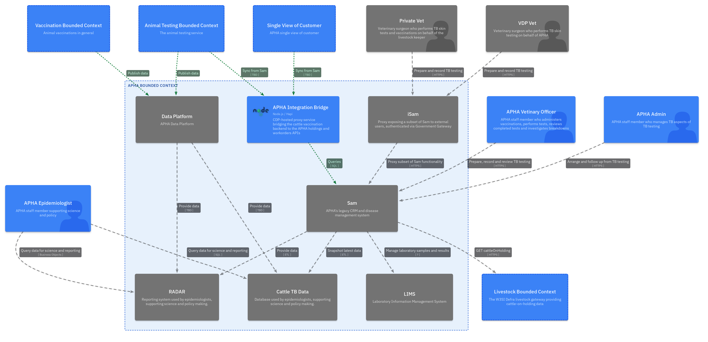

---

## 4.7 Security Architecture
<!-- _class: split split-40-60 -->

This architecture provides security through layered controls at each boundary:

- **Edge protection**: public ingress is fronted by AWS Shield and AWS WAF, reducing DDoS and common web attack risk before traffic reaches services.
- **Network zoning**: workloads are split across public and protected subnets/Fargate clusters; the backend BFF remains in a private path.
- **Controlled ingress routing**: ALBs and API Gateway enforce managed entry points.
- **Identity and secret handling**: service credentials (Cognito client ID/secret, Salesforce client ID/secret, Livestock bearer token) are injected via CDP secrets management. No credentials in source code.
- **Constrained egress**: outbound traffic is forced through the CDP proxy and allow-list model.
- **Input validation**: all inbound requests validated with Joi schemas; all SOQL queries escape single quotes to prevent injection.

These controls are complemented by SOC log ingestion and AWS Config compliance monitoring across CDP accounts.

 References: [CDP Architectural Overview](https://portal.cdp-int.defra.cloud/documentation/architecture/architectural-overview.md) | [CDP shared responsibility model](https://portal.cdp-int.defra.cloud/documentation/onboarding/shared-responsibility-model.md)

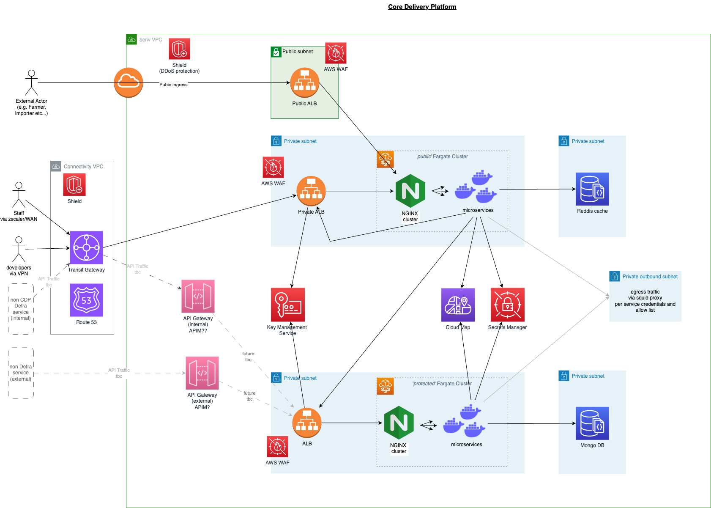

---

## 4.8 Deployment Architecture
<!-- _class: split split-30-70 -->

Deployment on CDP follows an infrastructure-as-code model. Platform and service infrastructure are defined in Terraform, with pipeline execution via GitHub Actions and promotion through lower to higher environments before production.

 Responsibilities are split as follows:
- CDP platform team owns core platform infrastructure, shared security controls and foundational runtime capabilities.
- Service teams own service code, deployment intent/configuration, application behaviour and service-level release decisions.

Environments: dev, test, perf-test, ext-test, prod — each with its own Cognito user pool URL and credentials.

📌 <strong>Action:</strong> Document environment-specific promotion, rollback and break-glass operations in service runbooks.

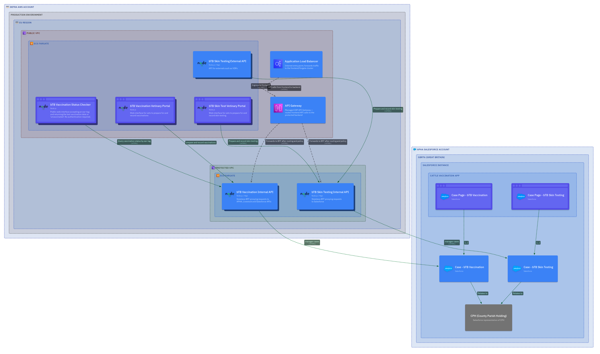

---

## 4.9 User Roles

| Role Type              | Brief Description                                                                                                     | Usage of the product                                                                                                                                       |
|------------------------|-----------------------------------------------------------------------------------------------------------------------|------------------------------------------------------------------------------------------------------------------------------------------------------------|
| Private Vet            | Veterinary surgeon who performs TB skin tests and vaccinations on behalf of the livestock keeper                      | Currently prepares and records TB testing via iSam (authenticated via Government Gateway). Will look up cattle, record skin measurements and submit results via the cattle vaccination frontend (future). |
| VDP Vet                | Veterinary surgeon who performs TB skin testing on behalf of APHA                                                    | Currently prepares and records TB testing via iSam (authenticated via Government Gateway). Views workorders and submits test results via VDP systems.       |
| APHA Veterinary Officer | APHA staff member who administers vaccinations, performs tests, reviews completed tests and investigates breakdowns   | Reviews and manages TB test cases and vaccinations in Salesforce; will prepare for and record TB testing and vaccination site visits via the frontend (future) |
| APHA Admin             | APHA staff member who manages TB aspects of TB testing                                                               | Reviews and manages TB testing and vaccination records via Salesforce case pages                                                                            |
| APHA Epidemiologist    | APHA staff member supporting science and policy                                                                      | Queries TB data for science and reporting via cattleTbData and RADAR; no direct interaction with the cattle vaccination frontend                            |
| Public                 | Member of the public or industry participant checking cattle vaccination status                                       | _(Future)_ Checks the last vaccination date for a tagged animal via the bTB Vaccination Status Checker. No authentication required.                        |

---

## 4.10 Support

For more details of supporting services on CDP, see [CDP Shared Support Model](https://portal.cdp-int.defra.cloud/documentation/onboarding/shared-responsibility-model.md).

📌 <strong>Action:</strong> Spell out service hours, escalation paths and where incidents are logged (beyond the CDP shared model link).

---

## 4.11 Architecture Evolution

The solution is delivered incrementally across six stages from the current Sam-centric state to the full future architecture.

| Stage | Capability Added |
|-------|-----------------|
| 1 | Minimal Vaccination Recording — APHA staff record vaccinations via internal Salesforce screens |
| 2 | Public Vaccination Status — Public ear-tag status checker; no authentication required |
| 3 | Test Viewing — APHA staff view TB test data via Salesforce internal screens |
| 4 | SICCT Testing (Vet Portal) — Private and APHA vets submit skin test results via a CDP-hosted portal |
| 5 | SICCT Testing (VDP API) — VDP systems submit test results via an External API |
| 6 | Vaccination Vet Portal — Private vets access a CDP-hosted portal; Defra Customer Identity auth |

---

### Stage 1 — Minimal Vaccination Recording
<!-- _class: split split-30-70 -->

APHA Vets and Admins record TB vaccinations via internal Salesforce screens. The APHA Integration Bridge syncs CPH data from Sam into the Single View of Customer. No external vet portal. Data is available to consume by systems such as cattleTbData and RADAR via the APHA Data Platform.

---

### Stage 2 — Public Vaccination Status
<!-- _class: split split-30-70 -->

Adds a public-facing status checker so that any member of the public can look up the last vaccination date for a tagged animal. No authentication required.

---

### Stage 3 — Test Viewing
<!-- _class: split split-30-70 -->

APHA staff can view TB skin test data in Salesforce via new internal case-management screens. The APHA Integration Bridge provides test records and workorder data from Sam.

---

### Stage 4 — SICCT Testing (Vet Portal)
<!-- _class: split split-30-70 -->

Adds a CDP-hosted testing portal for private vets and APHA vets to submit SICCT skin test results. Authentication via Defra Customer Identity.

---

### Stage 5 — SICCT Testing (VDP API)
<!-- _class: split split-30-70 -->

Adds a new External API for Veterinary Delivery Partner systems (e.g. UK FarmCare TOM) to retrieve workorders and submit test results programmatically, complementing the vet portal from Stage 4.

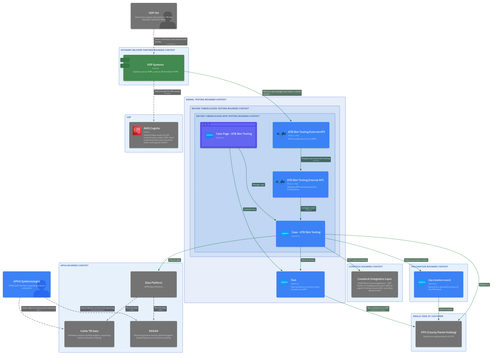

---

### Stage 6 — Vaccination with Vet Portal
<!-- _class: split split-30-70 -->

Adds a CDP-hosted frontend for private vets to prepare for and record TB vaccination site visits. Authentication via Defra Customer Identity (Government Gateway or GOV.UK One Login).

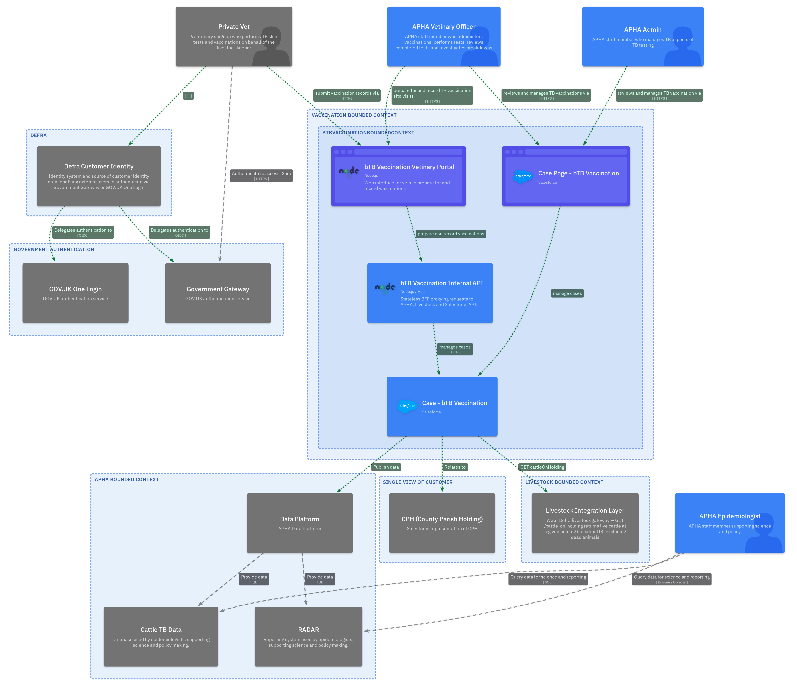

---

# 5. Patterns

## 5.1 Patterns Consumed
| Requirement                  | Pattern                    | Supplier / Support        |
|------------------------------|----------------------------|---------------------------|
| Cloud Hosting Platform       | CDP                        | Amazon Web Services / CDP |
| Deployment orchestration     | CDP Portal                 | Amazon Web Services / CDP |
| Authentication/Authorisation | OAuth 2.0 (Cognito)        | Amazon Web Services / CDP |
| API Management Solution      | CDP API Gateway            | Amazon Web Services / CDP |
| Secure credential management | CDP Secrets Management     | Amazon Web Services / CDP |
| Runtime web application      | CDP ECS Fargate            | Amazon Web Services / CDP |
| Monitor and Logging          | CDP (CloudWatch + SOC)     | Amazon Web Services / CDP |
| CRM / Case Management        | Salesforce                 | Salesforce                |

📌 <strong>Action:</strong> Validate consumed patterns; update the table when the stack changes.

---

## 5.2 Patterns Exported

| Requirement | Pattern | Supplier / Support |
|---|---|---|
| | | |

📌 <strong>Action:</strong> List only patterns other programmes can genuinely reuse; remove rows that are not offered as shared services.

---

# 6. Cut-over, Conversion and Fall-back

## 6.1 Cut-over

📌 <strong>Action:</strong> Capture high-level cutover only (phased / parallel / big bang; migration; embargo; interfaces; decommission). Point to detailed runbooks where they exist.

## 6.2 Conversion

📌 <strong>Action:</strong> Describe data conversion sources, mapping and validation; link to conversion runbooks.

## 6.3 Fall-back

📌 <strong>Action:</strong> Outline business and IT fall-back if cutover fails; who decides rollback and how users are informed.

---

# 7. Architectural Dependencies

| Dependency On          | Details                                                                                                                                                                                                                                | Supplier  |
|------------------------|----------------------------------------------------------------------------------------------------------------------------------------------------------------------------------------------------------------------------------------|-----------|
| Core Delivery Platform | Defra Cloud platform hosting provider — required to host dev, test and production environments. Provides foundation services for development, deployment and production security and monitoring.                                       | CDP       |
| APHA Integration Bridge | CDP-hosted proxy to APHA APIs — required for workorder and holdings data.                                                                                                                                                             | APHA / CDP |
| Livestock API          | W3SI Defra livestock gateway — required for cattle-on-holding data.                                                                                                                                                                   | Defra W3SI |
| Salesforce             | CRM — required for case creation and test result storage.                                                                                                                                                                              | Salesforce |

---

# 8. Glossary
| Acronym | Description                                                                                                     |
|---------|-----------------------------------------------------------------------------------------------------------------|
| API     | Application Programming Interface                                                                               |
| APHA    | Animal and Plant Health Agency                                                                                  |
| ASVS    | OWASP Application Security Verification Standard                                                                |
| AWS     | Amazon Web Services                                                                                             |
| BFF     | Backend for Frontend — a server-side aggregation layer that serves a specific frontend client                   |
| CDP     | Core Delivery Platform                                                                                          |
| CPH     | County/Parish/Holding — the unique identifier for a farm holding in the UK                                      |
| CRM     | Customer Relationship Management                                                                                |
| Defra   | Department for Environment, Food and Rural Affairs                                                              |
| DPIA    | Data Protection Impact Assessment                                                                               |
| GDS     | Government Digital Service                                                                                      |
| OWASP   | Open Worldwide Application Security Project                                                                     |
| SDA     | Solution Design Authority                                                                                       |
| SICCT   | Single Intradermal Comparative Cervical Tuberculin — the standard TB skin test used in cattle                   |
| W3SI    | Wider Defra systems integration gateway                                                                         |

---

<!--
_footer: ''
_paginate: false
-->

        
  
End

